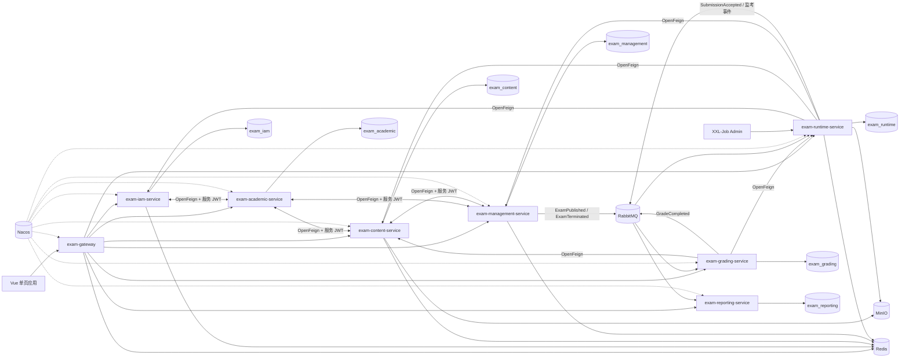

# EkuExam Cloud 架构与组件选型

> 本文保留原始分析基线；2026-09-19 仅整理结构，未重新验证技术结论。面试表达已移至 [组件选型面试回答](../面试准备/组件选型面试回答.md)。

## 1. 文档范围与结论

本文分析的是当前仓库中的最新微服务实现，而不是根目录下的旧单体代码。

- 分析日期：2026-08-20
- 当前 Git 提交：`df5c136e367472eab6ffa8051ce9a117518688bb`
- 版本的含义：以当前 `pom.xml`、`package-lock.json`、`docker-compose.yml`、各服务 `application.yml`、Nacos 配置、Java 代码和 Flyway 迁移为准。
- 需要特别区分：“仓库当前使用版本”不等于“上游官方最新版本”。

系统的核心选型可概括为：

> Java 21 + Spring Boot 4 构建业务服务，Spring Cloud Gateway 统一入口，Nacos 完成注册发现和配置管理，OpenFeign + LoadBalancer 完成同步调用，RabbitMQ + Outbox/Inbox 完成可靠异步协作，MySQL + Flyway 实现每服务独立 Schema 及版本化迁移，Redis 承载限流、会话、缓存、租约和延迟任务，MinIO 保存题目图片和防作弊证据，XXL-Job 负责超时交卷等调度任务，Actuator + Micrometer + Prometheus 提供可观测性。

## 2. 整体架构

### 2.1 架构风格

当前系统采用了以下架构思路：

1. **按业务能力拆分服务**：身份、教务、内容、考试管理、考试运行时、评分、报表各自独立。
2. **一个服务拥有自己的数据**：业务服务使用各自 MySQL Schema，不跨库联表。
3. **同步查询与异步事件并用**：需要即时结果时使用 Feign，需要解耦和最终一致时使用 RabbitMQ。
4. **CQRS 式读模型**：`exam-reporting-service` 消费事件构建报表投影，查询时不需要跨多个业务库联查。
5. **本地事务 + Outbox/Inbox**：业务数据和 Outbox 事件同事务落库，消费端通过 Inbox 或唯一约束去重，实现“至少一次投递 + 幂等消费”。

## 3. 业务服务的选型与作用

| 服务 | 核心职责 | 主要组件 | 为什么这样拆分 |
|---|---|---|---|
| `exam-gateway` | 统一路由、CORS、JWT 初步验证、请求大小限制、考试入场限流、客户端 IP 处理 | Spring Cloud Gateway WebFlux、Reactive Redis、Spring Security、Micrometer | 把通用的流量和安全边界放在业务服务之前，但细粒度角色授权仍由后端服务执行 |
| `exam-iam-service` | 登录、刷新和注销、用户角色、JWT 签发、服务身份令牌、认证限流 | Spring Security、JJWT、Redis、MyBatis-Plus/JdbcTemplate、RabbitMQ | 将人类用户与服务身份统一收口，业务服务只保留资源服务职责 |
| `exam-academic-service` | 学科、课程、教学班、教师和学生档案、班级名册 | MyBatis-Plus/JdbcTemplate、Feign、CSV 导入 | 教务主数据与账号、考试数据分离，避免其他服务直接读教务库 |
| `exam-content-service` | 题库、试卷、发布时的试卷快照、题目图片 | MyBatis-Plus/JdbcTemplate、Redis、MinIO、Feign | 使用不可变试卷快照避免“考后改题影响历史考试”，对象存储避免大文件进数据库 |
| `exam-management-service` | 考试创建、排期、发布、终止、考生范围、监考策略 | MyBatis-Plus/JdbcTemplate、Redis、Feign、RabbitMQ/Outbox | 管理“考试定义”而不承载高频答题，发布后用事件通知 Runtime 预置数据 |
| `exam-runtime-service` | 入场、候考票据、答题快照、客户端租约、防作弊、手工/超时交卷 | Redis、Caffeine、MySQL、RabbitMQ/Outbox/Inbox、XXL-Job、MinIO、Micrometer | 它是考试期间的高并发核心，独立扩容且用 L1/L2 缓存、Lua 原子操作和租约降低数据库压力 |
| `exam-grading-service` | 客观题自动判分、主观题任务、成绩汇总 | RabbitMQ/Inbox/Outbox、Feign、JdbcTemplate | 评分与交卷主链路解耦，评分失败不应否定交卷已受理 |
| `exam-reporting-service` | 学生成绩、分数分布、错题统计、监考看板、操作审计 | RabbitMQ/Inbox、JdbcTemplate、独立投影表 | 将聚合查询和交易库分开，用最终一致换取稳定的报表性能 |

### 3.1 公共契约模块 `apis/`

`apis/` 只保存跨服务 DTO 和稳定契约，不保存业务实现。当前包括：

- `exam-iam-api`：用户摘要、批量查询、服务令牌 DTO。
- `exam-academic-api`：学科、教学班、班级名册、用户档案契约。
- `exam-content-api`：试卷摘要、试卷快照及快照题目契约。
- `exam-management-api`：Runtime 所需的考试准入、元数据、监考上下文。
- `exam-runtime-api`：Grading 所需的交卷和答案输入。

这种拆分比“调用方直接依赖被调用服务的实体类”更安全，因为它限制了编译时耦合，也为契约的向后兼容演进留出边界。

### 3.2 公共能力模块 `platform/`

| 模块 | 作用 |
|---|---|
| `exam-common-core` | `ApiResponse`、`PageResponse`、通用异常与 JSON/时间基础能力 |
| `exam-common-security` | OAuth2 Resource Server、RSA JWT 验签、角色/scope 映射、Feign 服务令牌注入、禁止 Feign 自动重试 |
| `exam-outbox-support` | Outbox 写入、批量租约领取、并发发布、publisher confirm、指数退避、失败和清理 |
| `exam-audit-support` | 基于 AOP 捕获操作审计，通过 Outbox 发布 `AuditOperationRecorded` |
| `exam-csv-import-support` | 用户、教务和考试排期批量导入的 CSV 解析基础能力 |

`platform/` 承载的是已经跨多个服务重复使用的基础能力，不应变成包含所有业务逻辑的“超级 common 模块”。

## 4. 基础技术栈选型

### 4.1 Java、Maven 与 Spring Boot

| 组件 | 当前版本 | 在本系统中的作用 | 选型理由与代价 |
|---|---:|---|---|
| Java | 21 | 所有后端服务的语言与运行时 | LTS 版本，性能、GC、record/模式匹配等语言能力成熟；需要部署环境统一 JDK 21 |
| Maven Wrapper | Maven 3.9.14，wrapper 3.3.4 | 18 个聚合模块的依赖管理、编译和测试 | Wrapper 锁定构建工具；多模块边界清晰，但全仓构建成本高于单模块 |
| Spring Boot | 4.0.4 | 自动配置、WebMVC/WebFlux、数据访问、安全、消息、Actuator | 开发效率高、生态完整；Boot 4 要求新 Java/Spring 基线，升级时需重点测试三方 Starter |
| Spring Framework / Security | 由 Boot 4.0.4 管理；Security 解析为 7.0.4 | IoC、AOP、事务、MVC、方法授权 | 使用 BOM 管理互相兼容的版本，不在子模块随意单独覆盖 |
| Lombok | Boot 依赖管理 | 减少 DTO、实体和构造器样板代码 | 提高编码效率，但依赖注解处理器和 IDE 支持 |

除网关外，业务服务基本使用 Servlet/WebMVC；网关单独使用 WebFlux，是因为网关要处理大量 I/O 转发和响应式限流，而不是为了将所有业务强行改造为响应式编程。

### 4.2 Spring Cloud 与服务治理

| 组件 | 当前版本 | 作用 | 在本系统中的实际落地 |
|---|---:|---|---|
| Spring Cloud BOM | 2025.1.0，核心 Starter 解析为 5.0.0 | 管理 Gateway、OpenFeign、LoadBalancer 等兼容版本 | 聚合 POM 统一导入，子模块不分别锁版本 |
| Spring Cloud Gateway | 5.0.0 | API 统一入口、动态路由、CORS、过滤、限流 | 使用 `lb://service-name` 路由七个业务服务；答题快照/交卷请求限制为 5 MB |
| Spring Cloud Alibaba | 2025.1.0.0 | Nacos 与 Spring Cloud 的适配 | 各服务使用相同 namespace 和 `EXAM_GROUP` |
| Nacos Server / Client | Server 3.1.1，Client 解析为 3.1.1 | 服务注册发现和集中配置 | 每个服务导入 `exam-common.yml` 与自身配置；服务名作为发现键 |
| OpenFeign | 5.0.0 | 声明式 HTTP 跨服务调用 | Runtime 查 Management/Content/IAM，Grading 查 Runtime/Content 等；连接 1 s、读取 3 s |
| Spring Cloud LoadBalancer | 5.0.0 | 根据 Nacos 实例列表做客户端负载均衡 | Gateway 路由、Feign 和获取 IAM 服务令牌的 `RestClient` 都可以按服务名访问 |

当前的重要边界：

- Feign 默认连接超时 1 秒、读取超时 3 秒。
- 公共安全模块明确将 Feign `Retryer` 设为 `NEVER_RETRY`，避免非幂等请求被客户端隐式重试。
- 当前没有看到 Resilience4j/Sentinel 熔断器、服务网格或分布式调用链追踪的完整落地，面试时不应声称已具备。

### 4.3 数据库与持久化

| 组件 | 当前版本 | 作用 | 选型说明 |
|---|---:|---|---|
| MySQL Server | 8.4 | 业务事务数据、Outbox/Inbox、报表投影 | 具备成熟事务、索引、唯一约束和 JSON 能力；本地 Compose 是单实例多 Schema，不代表生产高可用架构 |
| MySQL Connector/J | 解析为 9.6.0 | Java 连接 MySQL | 由 Spring Boot BOM 管理兼容版本 |
| HikariCP | 解析为 7.0.2 | JDBC 连接池 | Runtime 显式配置最大 24、最小空闲 8、2 s 获取超时，用于限制高并发下的数据库资源上界 |
| MyBatis-Plus | 3.5.14 | 常规实体 CRUD、条件查询和分页 | 对简单业务开发效率高；复杂事务、批量 upsert、Outbox 和投影则直接使用 `JdbcTemplate` |
| Flyway | 解析为 11.14.1 | 每个服务自主执行版本化 Schema 迁移 | 让数据库结构跟随代码可审计地演进；已发布脚本不能原地修改 |

本系统并没有为了“纯技术栈”而强制只使用 MyBatis-Plus。简单表 CRUD 使用 Mapper，而 Runtime、Grading、Reporting 中的复杂 SQL 使用 `JdbcTemplate`，这是“根据访问模式选工具”的混合持久化策略。

### 4.4 Redis 与本地缓存

| 组件 | 当前版本 | 作用 |
|---|---:|---|
| Redis Server | 7.4-alpine | 分布式限流、刷新令牌会话、试卷/考试元数据缓存、入场票据、客户端租约、答题快照、待刷盘延迟队列 |
| Spring Data Redis | 4.0.4 | 业务服务的同步 Redis 访问，以及 Gateway 的响应式 Redis 访问 |
| Caffeine | 解析为 3.2.3 | Runtime 的试卷交付 L1 进程内缓存 |

当前 Redis 不只是一个普通查询缓存：

- Gateway 使用 Lua 令牌桶实现入场接口的多实例共享限流。
- IAM 保存 refresh token ID，并用 Lua 原子实现旋转和撤销；登录/刷新限流也使用 Redis。
- Content 和 Management 缓存试卷交付数据和考试元数据，并有预热和防缓存击穿锁。
- Runtime 使用 Caffeine L1 + Redis L2 缓存试卷，同时将 Redis ZSet/Hash/String + Lua 组合成可租约领取、失败退避、恢复与清理的快照刷盘队列。

需要注意：Compose 中只是一个 Redis 实例，通过 database 0、1、2、3 做逻辑分区，并不是物理隔离或 Redis Cluster。

### 4.5 RabbitMQ、Outbox 与 Inbox

| 组件 | 当前版本 | 作用 |
|---|---:|---|
| RabbitMQ Server | 4.1-management | 承载考试生命周期、交卷、评分、监考和审计事件 |
| Spring AMQP | 解析为 4.0.2 | RabbitTemplate、交换机/队列声明、`@RabbitListener`、消费重试 |
| RabbitMQ Java Client | 解析为 5.27.1 | 底层 AMQP 通信 |
| 共享 Topic Exchange | `exam.events` | 按 `eventType` 路由多类领域事件 |
| DLX/DLQ | 按 Grading、Runtime、Reporting 分开 | 消费重试耗尽后隔离毒消息，避免无限重回队列 |

关键事件流向：

| 事件 | 主要生产者 | 主要消费者 | 作用 |
|---|---|---|---|
| `ExamPublished` | Management | Runtime、Reporting | Runtime 预置考试与考生数据，Reporting 建立考试投影 |
| `ExamTerminated` | Management | Runtime、Reporting | 终止运行时考试并更新报表状态 |
| `SubmissionAccepted` | Runtime | Grading、Reporting | 触发评分，同时更新交卷投影 |
| `GradeCompleted` | Grading | Reporting | 投影总分、及格状态和客观题结果 |
| `SessionStarted` / `ProctoringEventRecorded` | Runtime | Reporting | 更新考生作答状态和监考看板 |
| `AuditOperationRecorded` | 使用 Audit Support 的服务 | Reporting | 形成统一操作审计读模型 |

Outbox/Inbox 解决的不是“消息绝对不重复”，而是以可恢复方式实现下列语义：

1. 业务表和 `outbox_event` 在同一个本地事务中提交。
2. 后台发布器通过租约批量领取待发送事件，多实例间避免同时抢到同一行。
3. RabbitMQ publisher confirm 成功后标记已发布；失败时按带 jitter 的指数退避重试。
4. 如果在“Broker 已收到、但数据库还未标记成功”之间崩溃，消息可能重复。
5. 消费端以 `event_id + consumer_name` 的 Inbox 唯一约束或等价业务唯一约束实现幂等。

因此，面试时准确的表述是“至少一次投递 + 幂等消费 + 最终一致”，不是“绝对不丢不重”或“精确一次”。

### 4.6 安全组件

| 组件 | 当前版本 | 作用 | 实际安全边界 |
|---|---:|---|---|
| Spring Security | 解析为 7.0.4 | 登录认证、网关验签、资源服务、方法级 RBAC | Gateway 要求通用请求已认证；各服务使用 `@PreAuthorize` 校验 ADMIN/TEACHER/STUDENT |
| JJWT | 0.12.7 | IAM 签发和解析 JWT | RSA256 非对称签名，私钥只在 IAM，网关和业务服务仅持有公钥 |
| OAuth2 Resource Server | Boot 4.0.4 管理 | 业务服务无状态验签、角色和 scope 映射 | `/internal/v1/**` 必须具有 `SCOPE_internal` |
| DelegatingPasswordEncoder | Spring Security 管理 | 密码哈希与算法标识 | 方便密码算法演进；不保存明文密码 |

用户令牌和服务令牌是两条不同的链路：

- 用户 access token 的 `typ=access`，包含 `uid`、`roles`、`tokenVersion`。
- refresh token 的 `typ=refresh`，其 token ID 在 Redis 中做旋转和撤销，通过 HttpOnly Cookie 交付。
- 服务先使用 client ID/shared secret 从 IAM 换取短期 `typ=service` 令牌，再由 Feign 拦截器加到内部请求。
- 业务服务把 `roles` 映射为 `ROLE_xxx`，把 `scope` 映射为 `SCOPE_xxx`。
- `tokenVersion` 可用于修改密码或管理员操作后统一使旧令牌失效。

### 4.7 对象存储与任务调度

| 组件 | 当前版本 | 作用 | 说明 |
|---|---:|---|---|
| MinIO Java SDK | 8.5.12 | 上传、读取和删除题目图片，保存防作弊证据 | 与 S3 概念相近，适合自托管开发环境；需要单独处理权限、生命周期和孤儿对象清理 |
| MinIO Server | `minio/minio:latest` | 本地对象存储 | `latest` 无法保证可重复部署，生产应锁定具体 tag 或 digest |
| XXL-Job | 3.4.0 | 分布式任务调度和运维管理 | Runtime 注册 `examTimeoutSubmitJob`，用于扫描并推进超时交卷；业务处理仍需幂等和租约，不能假设调度只执行一次 |

### 4.8 可观测性与测试

| 组件 | 当前版本 | 作用 |
|---|---:|---|
| Spring Boot Actuator | 4.0.4 | `health`、`info`、`metrics`，Gateway/Runtime 还开放 `prometheus` |
| Micrometer | 解析为 1.16.4 | 统一指标 API，记录入场请求、激活事务、缓存加载、超时交卷、Outbox 等指标 |
| Prometheus Registry | 1.16.4 | 将 Micrometer 指标暴露为 Prometheus 格式 | 仓库已有指标暴露，但标准 Compose 中没有 Prometheus/Grafana 服务 |
| JUnit Jupiter | 解析为 6.0.3 | 单元与集成测试 |
| Mockito | 解析为 5.20.0 | 隔离 Feign、Redis、JDBC 等依赖做单元测试 |
| Testcontainers | 2.0.5 | 启动真实 MySQL/Redis 容器验证租约、并发领取、快照刷盘等数据库语义 |

系统当前更偏重指标和健康检查。代码中未看到完整的 OpenTelemetry/Tempo/Jaeger 链路追踪闭环，也没有在标准 Compose 中启动 Prometheus 和 Grafana。

### 4.9 容器与本地部署

| 组件 | 当前选型 | 作用 |
|---|---|---|
| 应用基础镜像 | `eclipse-temurin:21-jre` | 只携带 JRE 运行各服务可执行 JAR |
| Docker Compose | `docker-compose.yml` | 统一编排 MySQL、Redis、RabbitMQ、MinIO、Nacos、XXL-Job Admin、Gateway 和七个业务服务 |
| Compose 命名卷 | `jwt-key-init` 生成的 JWT 公私钥 | 不将密钥写入镜像、仓库或宿主机部署脚本 |

`docker-compose.yml` 定义的是本地/联调标准栈，不是生产高可用方案：MySQL、Redis、RabbitMQ、Nacos、MinIO 都是单节点，也没有 Kubernetes、自动扩缩容、多可用区和专用密钥管理服务。

## 5. 前端与后端的边界

虽然 Java 面试应将重点放在后端，但完整架构中还有一个 Vue 单页应用。以 `package-lock.json` 的实际锁定版本为准：

| 组件 | 锁定版本 | 作用 |
|---|---:|---|
| Vue | 3.5.30 | Composition API 界面开发 |
| Vue Router | 4.6.4 | 管理员、教师、学生页面路由 |
| Pinia | 3.0.4 | 认证与全局状态 |
| Axios | 1.13.6 | 统一从网关调用后端 API |
| Element Plus | 2.13.6 | 管理端和业务表单/表格 UI |
| ECharts | 5.6.0 | 成绩、分布、趋势和监控图表 |
| Vite | 6.4.1 | 开发服务器与生产构建 |

前端只通过 Gateway 的 `/api/v1/**` 访问后端，不绑定具体业务服务地址。

## 6. 三条关键业务链路

### 6.1 登录与鉴权

1. 前端将账号密码发给 Gateway，Gateway 路由到 IAM。
2. IAM 使用 Spring Security + `PasswordEncoder` 验证密码。
3. IAM 使用 RSA 私钥签发 access token 和 refresh token。
4. access token 返回前端，refresh token 通过 HttpOnly Cookie 保存，其 token ID 在 Redis 中留存。
5. 后续请求先由 Gateway 校验 issuer、签名、过期时间和 `typ=access`。
6. 业务服务再校验 JWT，并使用 `@PreAuthorize` 做角色/权限判断。

为什么 Gateway 和业务服务都验证？Gateway 是外部边界，但业务服务不应因为希望“流量一定来自网关”就放弃自身授权，这是纵深防御。

### 6.2 考试发布与入场

1. Management 检查教学班和考生名册，调用 Content 生成不可变试卷快照。
2. Management 在本地事务中保存发布状态、考生和 `ExamPublished` Outbox 事件。
3. Outbox 发布器将事件投递到 RabbitMQ。
4. Runtime 消费事件，幂等预置考试定义与考生数据；Reporting 同时构建考试投影。
5. 考前 Management/Content 对元数据和试卷快照进行预热。
6. 学生入场时，Gateway 先用 Redis 限流，Runtime 再校验候考窗口、候考票据、考生资格和时间槽。
7. Runtime 优先从 Caffeine L1 交付试卷，L1 未命中时查 Redis L2，必要时再调用 Content 回源。

### 6.3 答题、交卷、评分与报表

1. 答题期间，Runtime 将高频快照保存到 Redis，使用 Lua + ZSet 记录待刷盘任务。
2. 后台协调器通过租约批量领取任务，将最新快照增量刷入 Runtime MySQL；失败可退避、恢复和清理。
3. 手工交卷由 HTTP 请求触发；超时交卷由 XXL-Job 扫描和协调。
4. Runtime 保存交卷、最终答案和 `SubmissionAccepted` Outbox 事件。
5. Grading 消费事件，先写 Inbox 去重，再从 Runtime 取交卷答案、从 Content 取试卷快照，执行客观题判分或创建主观题任务。
6. 评分完成后 Grading 发布 `GradeCompleted`。
7. Reporting 消费事件，幂等 upsert 成绩、客观题结果和统计投影，为学生、教师和管理员提供查询。

## 7. 选型中的取舍与当前风险

### 7.1 为什么不是所有调用都用 RabbitMQ

Feign 适合当前请求必须立即获取结果的场景，例如查试卷快照或考生名册。RabbitMQ 适合状态已经提交、后续处理可异步的场景，例如发布考试、受理交卷和完成评分。

如果全部改为同步调用，长链路会增加延迟并产生级联失败；如果全部改为消息，简单查询会变成复杂的请求-回复协议。当前是按交互语义混合使用。

### 7.2 为什么不用分布式事务

服务之间没有通过 XA/2PC 或 Seata 维持全局强一致，而是通过业务边界、本地事务、Outbox/Inbox 和状态补偿获得最终一致。优点是减少全局锁定和单点协调依赖，代价是要明确接受短时间不一致，并设计幂等、重试、死信、对账和运维重放。

### 7.3 当前实现需要诚实说明的限制

1. **Compose 不是生产高可用方案**：基础设施为单节点，MySQL/Redis 的隔离也是逻辑隔离。
2. **未锁定全部镜像**：MinIO 使用 `latest`，Temurin 只锁定到 `21-jre`，可重复部署仍可改进。
3. **容错链路不完整**：Feign 有超时且禁止自动重试，但尚未看到统一熔断、隔离舱、fallback 和全链路预算。
4. **可观测闭环尚不完整**：已有 Actuator、Micrometer 和 Prometheus 指标出口，但标准栈没有指标存储、告警、看板和分布式追踪组件。
5. **消息契约要求协调演进**：Runtime 与 Grading 都声明了部分相同 RabbitMQ 拓扑，目前参数一致，以后修改队列/DLX 时必须同步发布。
6. **Nacos 配置导入标记为 `optional:`**：它不代表服务在缺少数据源、JWT 等关键配置时仍能完整工作，生产需要发布前配置校验。
7. **一致性是最终一致**：Reporting 可能短时落后于交易服务，需用指标、DLQ、重放和对账控制延迟。

## 8. 证据索引

本文的主要仓库依据：

- [聚合 POM：Java、Spring 与中间件版本](../../pom.xml)
- [标准微服务 Compose 栈](../../docker-compose.yml)
- [应用运行时镜像](../../Dockerfile)
- [Nacos 共享配置](../../deploy/nacos-config/exam-common.yml)
- [Gateway 路由、CORS、限流与端点暴露](../../deploy/nacos-config/exam-gateway.yml)
- [Runtime 高并发、快照、超时交卷与指标配置](../../deploy/nacos-config/exam-runtime-service.yml)
- [Runtime 外部依赖](../../services/exam-runtime-service/pom.xml)
- [公共资源服务安全配置](../../platform/exam-common-security/src/main/java/com/ekusys/exam/common/security/ResourceServerSecurityConfig.java)
- [服务身份与 Feign 令牌拦截](../../platform/exam-common-security/src/main/java/com/ekusys/exam/common/security/ServiceIdentityConfiguration.java)
- [Outbox 发布器](../../platform/exam-outbox-support/src/main/java/com/ekusys/exam/common/outbox/OutboxPublisher.java)
- [Runtime RabbitMQ 拓扑](../../services/exam-runtime-service/src/main/java/com/ekusys/exam/runtime/messaging/RuntimeRabbitConfig.java)
- [Grading 幂等消费](../../services/exam-grading-service/src/main/java/com/ekusys/exam/grading/messaging/SubmissionAcceptedConsumer.java)
- [Reporting 事件投影](../../services/exam-reporting-service/src/main/java/com/ekusys/exam/reporting/messaging/ReportingEventConsumer.java)
- [前端声明依赖](../../src/main/resources/frontend/package.json)
- [前端实际锁定版本](../../src/main/resources/frontend/package-lock.json)
