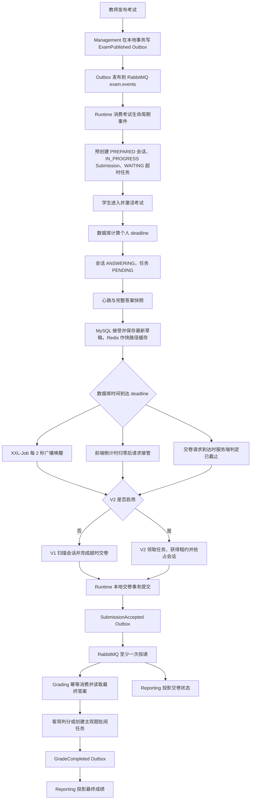

# 超时交卷完整业务流程

> 同步日期：2026-09-19
>
> 核对基准：当前工作区代码、Nacos 源配置、`docker-compose.yml`、Flyway 迁移和相关运维文档。
>
> 说明：仓库只能确认代码路径和仓库默认配置，不能据此确认运行中 Nacos、XXL-Job 控制台或外部编排的最终有效值。

## 1. 流程概览

超时交卷以 Runtime MySQL 中的会话、提交记录和截止时间为权威状态。浏览器倒计时和 XXL-Job 都只是触发入口，是否已截止、由谁完成最终交卷以及最终采用哪一版答案，均由 Runtime 使用数据库时间和数据库状态决定。

当前代码同时保留两条超时处理路径：

- V1：扫描已截止的 `exam_session`，逐条完成自动交卷；
- V2：通过 `submission_timeout_task`、行锁、任务租约和最终答案载荷协调多实例处理。

仓库标准 Compose 和 Nacos 源配置都将 `APP_TIMEOUT_SUBMISSION_V2_ENABLED` 的默认值设为 `false`，因此未显式覆盖时走 V1。某个实际环境是否启用 V2，需要以该环境所有 Runtime 实例的最终配置和启动日志为准。



## 2. 系统边界与模块职责

| 模块 | 在超时交卷流程中的职责 |
| --- | --- |
| 前端 `ExamDoing.vue` | 使用服务端时间校准倒计时；保存 IndexedDB 草稿；同步完整答案快照；截止后请求服务端接管并轮询权威状态；离线时保留本地答案和待交卷意图 |
| Gateway | 将考试入场、心跳、快照、交卷和状态查询路由到 Runtime；对 `/snapshot`、`/submit` 的 POST 请求限制 5 MB |
| Management | 发布或终止考试，并通过本地 Outbox 产生 `ExamPublished`、`ExamTerminated` 事件 |
| Runtime | 持有会话、客户端租约、草稿、Submission、超时任务和最终答案；协调手工交卷与超时交卷；写入 `SubmissionAccepted` Outbox |
| XXL-Job | 每 2 秒广播唤醒 `examTimeoutSubmitJob`，本身不保存交卷业务状态 |
| Runtime MySQL | 保存 `exam_session`、`submission`、`submission_draft_payload`、`submission_timeout_task`、`submission_final_payload`、`outbox_event` 等权威数据 |
| Redis | 保存客户端租约快路径、快照缓存、前端查询投影等可恢复数据，不是最终交卷状态的唯一权威源 |
| RabbitMQ | 至少一次投递 `SubmissionAccepted`、`GradeCompleted` 等领域事件 |
| Grading | 幂等消费交卷事件，从 Runtime 读取最终答案、从 Content 读取试卷快照，完成客观题判分或创建主观题批阅任务 |
| Reporting | 幂等消费交卷和成绩事件，形成学生结果、成绩统计和监控投影 |

## 3. 发布与入场

### 3.1 考试发布与预创建

1. 教师在 Management 发布考试。
2. Management 将冻结后的考生列表、考试时间、考试时长、试卷快照和监考配置写入 `ExamPublished` V2 事件，并与业务状态一起写入 Management Outbox。
3. Outbox Publisher 将事件发布到 `exam.events`。
4. Runtime 的 `RuntimeExamLifecycleConsumer` 消费事件；消费者使用 Inbox 记录保证同一事件不会重复执行业务创建。
5. `ExamProvisioningService` 按冻结考生列表批量预创建：
   - `exam_session.status = PREPARED`，`deadline_time = NULL`；
   - `submission.status = IN_PROGRESS`；
   - `submission_timeout_task.status = WAITING`，`due_at = NULL`，并关联对应 `submission_id`。
6. Runtime 核对 Session、Submission、Timeout Task 数量与候选人数一致，预热试卷缓存后将本地考试投影标记为 `READY`。

主要实现：

- [`ManagementOutboxService.java`](../services/exam-management-service/src/main/java/com/ekusys/exam/management/messaging/ManagementOutboxService.java)
- [`RuntimeExamLifecycleConsumer.java`](../services/exam-runtime-service/src/main/java/com/ekusys/exam/runtime/messaging/RuntimeExamLifecycleConsumer.java)
- [`ExamProvisioningService.java`](../services/exam-runtime-service/src/main/java/com/ekusys/exam/runtime/entry/ExamProvisioningService.java)
- [`V9__exam_entry_v2.sql`](../services/exam-runtime-service/src/main/resources/db/migration/V9__exam_entry_v2.sql)
- [`V12__add_submission_id_to_timeout_task.sql`](../services/exam-runtime-service/src/main/resources/db/migration/V12__add_submission_id_to_timeout_task.sql)

### 3.2 入场方式与兼容路径

前端优先使用 V2 入场接口：

1. `/entry/prepare` 校验本地考试投影和考生资格，发放带稳定时间槽的入场票据；
2. 到达分配的激活时刻后调用 `/entry/activate`；
3. 激活成功后调用 `/paper-delivery` 获取试卷和服务端已有草稿。

如果后端返回 `EXAM_ENTRY_V2_DISABLED` 或接口不存在，前端回退到 `/start`。当 Runtime 已有本地考试投影时，`/start` 由 `ExamEntryService.legacyStart` 兼容适配，内部仍依次执行准备、激活和试卷交付，只是不强制等待 V2 时间槽；仅在本地投影不存在时才进入更旧的 Management 查询路径。

仓库默认 `APP_EXAM_ENTRY_V2_ENABLED=false`，但考试预创建和超时任务预创建由生命周期消费者完成，不依赖前端最终选择哪种入场接口。

### 3.3 激活与个人截止时间

激活事务使用数据库当前时间计算个人截止时间：

```text
deadline = min(activatedAt + durationMinutes, examEndTime)
```

同一激活事务按 Timeout Task、Session 的固定顺序加锁并完成：

- `exam_session: PREPARED -> ANSWERING`；
- 写入 `start_time`、`deadline_time`、客户端标识和租约令牌；
- `submission_timeout_task: WAITING -> PENDING`；
- `due_at = deadline_time`；
- 写入 `SessionStarted` Outbox。

试卷交付会再次检查 Session 仍为 `ANSWERING`、数据库截止时间尚未到达且客户端仍持有有效租约。首次成功交付记录 `first_paper_delivered_at`；恢复进入时会带回服务端已有草稿。

主要实现：

- [`ExamEntryService.java`](../services/exam-runtime-service/src/main/java/com/ekusys/exam/runtime/entry/ExamEntryService.java)
- [`ExamActivationTransactionService.java`](../services/exam-runtime-service/src/main/java/com/ekusys/exam/runtime/entry/ExamActivationTransactionService.java)
- [`RuntimeExamController.java`](../services/exam-runtime-service/src/main/java/com/ekusys/exam/runtime/controller/RuntimeExamController.java)

## 4. 作答、租约与快照

### 4.1 客户端租约

每个答题会话只有当前 `client_id + lease_token` 可以续约、保存快照和主动交卷。前端按服务端返回的心跳周期续约；Runtime 使用数据库时间检查 Session 状态、截止时间和租约令牌。

浏览器窗口锁和本地状态只用于改善单窗口体验，服务端租约才是跨窗口和跨设备写入的权威约束。

### 4.2 本地草稿与服务端快照

1. 前端将完整答案保存在 IndexedDB，并维护单调递增的 `clientSequence` 和最近一次 `serverRevision`。
2. 前端定时或在主动交卷前调用 `/snapshot`，请求中携带完整答案、客户端序列、基础服务端版本、客户端标识和租约令牌。
3. Runtime 先校验答案结构和快照序列，再续约客户端租约。
4. `SnapshotDraftPayloadService.accept` 在 MySQL 事务中锁定 Session 与 Submission，使用数据库时间确认：
   - Session 仍为 `ANSWERING`；
   - `deadline_time` 尚未到达；
   - 客户端标识和租约令牌仍匹配；
   - 客户端序列没有回退，同一序列没有对应不同答案内容。
5. 接受成功后，Runtime 将压缩后的完整答案写入 `submission_draft_payload`，递增 `server_revision`，同步更新 `submission.draft_version` 和 `exam_session.last_snapshot_time`。
6. MySQL 事务成功后，Runtime 再把快照写入 Redis 快路径；Redis 不可用不会推翻已经完成的 MySQL 接受结果。
7. 旧版 `submission_answer` 草稿和 Redis 快照仍保留兼容读取路径。

### 4.3 超时交卷采用的答案

超时交卷调用 `ExamSnapshotService.loadLatestDraft`，读取顺序是：

1. 优先读取 `submission_draft_payload` 中已经由 MySQL 接受的最新完整草稿；
2. 没有新草稿载荷时，比较 Redis 快照与旧 `submission_answer` 草稿版本，采用版本较新者；
3. 都不存在时以空答案草稿继续交卷。

因此，超时最终答案的业务含义是：**截止前已经被 Runtime 数据库接受的最新完整答案版本**。只保存在浏览器本地、截止后才恢复网络或被 Runtime 拒绝的答案，不会自动进入最终答案。

快照接受事务和超时交卷都锁定同一 Session：先取得 Session 锁的一方决定边界。截止前已成功提交的快照已经持久化；超时任务抢占 Session 后，后续快照会因 Session 不再处于 `ANSWERING` 而被拒绝。

主要实现：

- [`ExamSnapshotService.java`](../services/exam-runtime-service/src/main/java/com/ekusys/exam/runtime/service/ExamSnapshotService.java)
- [`SnapshotDraftPayloadService.java`](../services/exam-runtime-service/src/main/java/com/ekusys/exam/runtime/service/SnapshotDraftPayloadService.java)
- [`SnapshotPersistenceService.java`](../services/exam-runtime-service/src/main/java/com/ekusys/exam/runtime/service/SnapshotPersistenceService.java)
- [`ExamClientLeaseService.java`](../services/exam-runtime-service/src/main/java/com/ekusys/exam/runtime/service/ExamClientLeaseService.java)
- [`V11__harden_timeout_submission_finalization.sql`](../services/exam-runtime-service/src/main/resources/db/migration/V11__harden_timeout_submission_finalization.sql)

## 5. 截止触发入口

### 5.1 XXL-Job 服务端触发

新 XXL-Job 数据卷的初始化脚本创建 `examTimeoutSubmitJob`：

- CRON：`0/2 * * * * ?`，每 2 秒触发；
- 路由策略：`SHARDING_BROADCAST`；
- 阻塞策略：`SERIAL_EXECUTION`；
- 调度失败重试次数：0，业务重试由 Runtime 自己处理。

XXL-Job 只传入分片参数并调用 Runtime，不保存任务状态，也不决定某个学生是否已经截止。

主要实现：

- [`02-configure-xxl-job.sh`](../deploy/mysql/init/02-configure-xxl-job.sh)
- [`ExamTimeoutSubmitJob.java`](../services/exam-runtime-service/src/main/java/com/ekusys/exam/runtime/job/ExamTimeoutSubmitJob.java)

### 5.2 浏览器倒计时归零

前端通过响应中的 `serverEpochMs` 估算服务端时钟偏移，并以 `deadlineEpochMs` 计算倒计时。倒计时归零后：

1. 停止倒计时，先查询 `/submission-status`，给服务端调度链一个处理窗口；
2. 如果 Runtime 尚未接管，调用 `/submit`，请求中携带空答案和当前租约信息，表示只请求服务端接管，不再尝试同步截止后的本地答案；
3. 如果浏览器先于服务器判断截止，Runtime 会按正常交卷校验拒绝空答案，前端随后携带完整答案重试主动交卷；
4. 收到 `SUBMITTING` 只表示 Runtime 已接管，前端继续轮询；
5. 只有 `runtimeFinalized=true` 或兼容的 Runtime 最终状态出现后，前端才清理 IndexedDB 草稿、同步队列和本地租约，并进入成绩页。

前端单次确认窗口约为 65 秒，轮询间隔约 10 秒并带抖动。确认窗口内没有得到最终状态时，页面保留本地答案和待交卷意图，不把状态误判为已完成。

### 5.3 交卷请求到达时服务端已截止

Runtime 在解析正常交卷答案之前先使用数据库时间判断 Session 是否已截止。若已经截止：

- V1 直接进入旧超时交卷事务；
- V2 检查持久化任务是否已经到期，必要时修复缺失任务或把 `PENDING` 任务的可领取时间加速到当前数据库时间，然后返回 `SUBMITTING`。

这样即使客户端时间存在偏差、请求答案为空或正常交卷校验不通过，服务端仍可把已经截止的会话交给超时流程。

### 5.4 离线截止与恢复网络

浏览器离线且本地倒计时到期时不会声称已经交卷，而是：

- 保留 IndexedDB 草稿和待交卷意图；
- 提示最终计入答案以截止前服务器已接收版本为准；
- 网络恢复后先尝试刷新同步队列；Runtime 仍以数据库截止时间校验，截止后的快照会被拒绝；
- 随后前端查询服务端权威状态并请求超时接管，离线期间未被服务端接受的新答案不会自动进入最终答案。

如果 V2 最终进入 `FAILED`，前端保存本地提交证据 7 天，并展示可与运维关联的 `incidentId`。

主要实现：

- [`submissionFlow.js`](../src/main/resources/frontend/src/utils/submissionFlow.js)
- [`ExamDoing.vue`](../src/main/resources/frontend/src/views/student/ExamDoing.vue)
- [`useServerClock.js`](../src/main/resources/frontend/src/composables/useServerClock.js)

## 6. V1 超时交卷流程

当 `app.timeout-submission.enabled=false` 时，`TimeoutSubmissionService` 执行 V1：

1. 按 `MOD(exam_session.id, shardTotal) = shardIndex` 扫描：
   - 已到 `deadline_time` 的 `ANSWERING` 会话；
   - 或 `claim_time` 已超过 60 秒的 `AUTO_SUBMITTING` 会话。
2. 每个分片每轮最多查询 200 条，逐条开启本地事务。
3. 条件更新 Session 为 `AUTO_SUBMITTING`；抢占失败表示其他请求已经处理该会话。
4. 读取截止前 Runtime 已接受的最新草稿。
5. 将对应 Submission 创建或更新为：
   - `status = PROCESSING`；
   - `timeout_submit = 1`；
   - 写入 `submitted_at`。
6. 删除旧答案并在 `submission_answer` 中重建最终答案，`source = TIMEOUT_SUBMIT`。
7. 在同一事务写入 `SubmissionAccepted` Outbox。
8. 将 Session 改为 `SUBMITTED`，清除客户端租约字段。
9. 事务提交后异步清理 Redis 快照。

单条处理失败会记录错误；已经进入 `AUTO_SUBMITTING` 的会话在抢占时间超过 60 秒后可由后续扫描再次处理。V1 不使用 V2 的任务租约、最终载荷、退避次数和永久失败状态机。

主要实现：

- [`TimeoutSubmissionService.java`](../services/exam-runtime-service/src/main/java/com/ekusys/exam/runtime/service/TimeoutSubmissionService.java)
- [`TimeoutSessionMapper.java`](../services/exam-runtime-service/src/main/java/com/ekusys/exam/runtime/repository/TimeoutSessionMapper.java)

## 7. V2 超时交卷流程

当 `app.timeout-submission.enabled=true` 时，`TimeoutSubmissionCoordinator` 执行 V2。

### 7.1 任务领取

每轮执行受 `max-run-ms` 总预算控制，同一 Runtime 实例不会并行执行重叠轮次。默认配置为：

- 领取批量：8；
- 工作线程：8；
- 任务租约：30 秒；
- 租约续期间隔：10 秒；
- 单任务预算：20 秒；
- 单轮预算：25 秒；
- 最大尝试次数：12。

实际领取量是 `min(batch-size, worker-count)`，工作池不设置等待队列。领取事务使用 `READ COMMITTED` 和 `FOR UPDATE SKIP LOCKED`，按以下顺序选择任务：

1. 全局领取租约已经过期的 `PROCESSING` 任务；
2. 领取当前 XXL-Job 分片中已经到达 `available_at` 的 `PENDING` 任务；
3. 多分片模式下，领取其他分片中已超过跨片等待时间的 `PENDING` 任务；
4. 如果仍有容量，再用当前分片任务补足。

`available_at` 由 `max(due_at, next_retry_at)` 的数据库生成列语义决定。每个成功领取的任务会：

- `PENDING/过期 PROCESSING -> PROCESSING`；
- 生成新的 UUID `claim_token`；
- 设置 `lease_until`；
- `attempt_count + 1`；
- 将 Session 从已截止的 `ANSWERING` 抢占为 `AUTO_SUBMITTING`，或接管原本已经是 `AUTO_SUBMITTING` 的会话。

任务缺失不会在每轮调度中自动批量补建。正常任务来自发布预创建或兼容入场的 `ensureTask`；截止交卷请求发现当前 Session 缺少任务时，会按该 Session 定点修复。后台积压刷新会统计并记录缺失任务和不一致状态。

### 7.2 任务处理与续租

工作线程开始处理后立即启动定时续租：

1. 读取 MySQL 已接受的最新完整草稿；
2. 将答案编码为 `GZIP_JSON_V1`，计算未压缩规范载荷的 SHA-256；
3. 在进入最终事务前检查任务未被取消、租约未丢失且未超过单任务预算；
4. 调度轮次超过总预算时，协调器取消未完成 Future、停止对应续租，并将仍归当前令牌所有的任务交回失败/重试流程。

只有持有当前 `claim_token` 且租约尚未过期的处理者可以完成最终事务。旧令牌即使稍后恢复执行，也不能覆盖新处理者的结果。

### 7.3 Runtime 最终事务

最终事务按 Task、Session 的固定顺序加锁并再次校验令牌、租约和业务身份，然后在 Runtime 单库同一事务中完成：

- 写入 `submission_final_payload`：
  - `source = TIMEOUT`；
  - 保存最终快照版本、压缩载荷和 SHA-256；
- `submission: IN_PROGRESS -> PROCESSING`；
- `timeout_submit = 1`；
- 写入 `submitted_at`；
- 写入 `SubmissionAccepted` Outbox；
- `exam_session: AUTO_SUBMITTING -> SUBMITTED`；
- `submission_timeout_task: PROCESSING -> DONE`。

事务提交后才异步清理 Redis 快照并刷新提交状态投影。

### 7.4 重试、永久失败与安全重放

任务处理失败时：

1. 当前处理者只有在仍持有有效令牌和租约时，才能记录失败；
2. 未达到最大尝试次数时，任务回到 `PENDING`，按指数退避和抖动写入 `next_retry_at`；Session 保持 `AUTO_SUBMITTING`，等待后续接管；
3. 达到最大尝试次数时，任务进入 `FAILED`，记录稳定 `failure_code`、`incident_id` 和 `failed_at`；
4. 在尚未形成最终载荷或 `SubmissionAccepted` 的前提下，Session 进入 `SUBMISSION_FAILED` 并清除客户端租约；
5. `/submission-status` 向前端返回失败码和事件号，前端保留本地证据，不清理答案。

ADMIN 或该考试的发布教师可以调用：

```text
POST /api/v1/exams/{examId}/timeout-submissions/{taskId}/replay
```

重放事务只接受以下组合：Task=`FAILED`、Session=`SUBMISSION_FAILED`、Submission=`IN_PROGRESS`，且不存在最终载荷和逻辑 `SubmissionAccepted` Outbox。校验通过后：

- Task 恢复为 `PENDING`、尝试次数清零、`replay_count + 1`；
- Session 恢复为 `AUTO_SUBMITTING`；
- 不直接写答案、最终载荷或 Outbox，由下一次 XXL-Job 领取后重新执行正常 V2 流程。

主要实现：

- [`TimeoutSubmissionCoordinator.java`](../services/exam-runtime-service/src/main/java/com/ekusys/exam/runtime/service/TimeoutSubmissionCoordinator.java)
- [`TimeoutTaskRepository.java`](../services/exam-runtime-service/src/main/java/com/ekusys/exam/runtime/repository/TimeoutTaskRepository.java)
- [`SubmissionFinalPayloadService.java`](../services/exam-runtime-service/src/main/java/com/ekusys/exam/runtime/service/SubmissionFinalPayloadService.java)
- [`TimeoutSubmissionReplayService.java`](../services/exam-runtime-service/src/main/java/com/ekusys/exam/runtime/service/TimeoutSubmissionReplayService.java)
- [`TimeoutSubmissionAdminController.java`](../services/exam-runtime-service/src/main/java/com/ekusys/exam/runtime/controller/TimeoutSubmissionAdminController.java)
- [`V8__timeout_submission_v2.sql`](../services/exam-runtime-service/src/main/resources/db/migration/V8__timeout_submission_v2.sql)
- [`V10__optimize_timeout_submission_claim.sql`](../services/exam-runtime-service/src/main/resources/db/migration/V10__optimize_timeout_submission_claim.sql)
- [`V11__harden_timeout_submission_finalization.sql`](../services/exam-runtime-service/src/main/resources/db/migration/V11__harden_timeout_submission_finalization.sql)

## 8. 主动交卷与超时交卷的互斥

### 8.1 V2 主动交卷

服务端数据库时间尚未到达截止时间时，主动交卷流程为：

1. 校验完整答案、客户端标识和租约令牌；
2. 使用请求答案生成 `submission_final_payload(source=MANUAL)`；
3. 在事务中先锁 Timeout Task，再锁 Session；
4. 只有 Task 仍可由主动交卷处理、Session 为 `ANSWERING`、数据库截止时间尚未到达且租约匹配时，才能把 Session 改为 `AUTO_SUBMITTING`；
5. 同一事务更新 Submission、写 `SubmissionAccepted` Outbox、将 Session 改为 `SUBMITTED`、将 Task 改为 `DONE`；
6. 事务提交后清理服务端 Redis 快照和客户端租约。

若 Task 已为 `PROCESSING` 或 Session 已为 `AUTO_SUBMITTING`，主动交卷不会再产生第二份最终结果，只返回 `SUBMITTING`。若 Session 已为 `SUBMITTED`，返回 Runtime 已完成状态。

锁冲突或死锁类异常由主动交卷服务进行有限次数重试。Task 缺失时先按当前 Session 定点修复，再进入固定锁顺序的最终事务。

### 8.2 V1 主动交卷

V1 在截止前直接使用请求中的完整答案重建 `submission_answer`，将 Submission 改为 `PROCESSING`、Session 改为 `SUBMITTED`，并在同一事务写 `SubmissionAccepted` Outbox。服务端一旦判断已经截止，就不再走主动交卷分支，而是转入 V1 超时交卷。

主要实现：

- [`ExamRuntimeService.java`](../services/exam-runtime-service/src/main/java/com/ekusys/exam/runtime/service/ExamRuntimeService.java)
- [`ManualSubmissionService.java`](../services/exam-runtime-service/src/main/java/com/ekusys/exam/runtime/service/ManualSubmissionService.java)

## 9. 提交状态与前端完成条件

Runtime 对外状态的核心语义如下：

| 状态/阶段 | 业务含义 | 前端是否清理本地答案 |
| --- | --- | --- |
| `ANSWERING` | 会话仍在作答，尚未被交卷流程抢占 | 否 |
| `SUBMITTING` / `HANDOFF_ACCEPTED` | Runtime 已接管或正在协调交卷，但本地最终事务尚未确认完成 | 否 |
| `PROCESSING` / `RUNTIME_FINALIZED` | Runtime 本地交卷事务已完成，等待异步判分 | 是 |
| Session=`SUBMITTED` 且 Submission=`PROCESSING` | Runtime 本地最终状态的兼容表示 | 是 |
| Task=`FAILED` / Phase=`FAILED` | V2 永久失败，尚未形成 Runtime 最终结果 | 否，保留本地证据 |

`submission.status = PROCESSING` 表示 Runtime 已接受最终交卷并等待后续判分，不表示成绩已经生成。Grading 不会把 Runtime Schema 中的 Submission 改为 `GRADED`；最终成绩状态属于 Grading 和 Reporting 各自的数据边界。

状态查询优先使用 Redis 中的最终或处理中投影，缓存缺失时回查 Runtime MySQL，并在需要时异步回填投影。MySQL 中的 Session、Submission、最终载荷和任务状态仍是权威来源。

主要实现：

- [`SubmissionStatusProjectionService.java`](../services/exam-runtime-service/src/main/java/com/ekusys/exam/runtime/service/SubmissionStatusProjectionService.java)
- [`SubmissionStatusView.java`](../services/exam-runtime-service/src/main/java/com/ekusys/exam/exam/dto/SubmissionStatusView.java)

## 10. 考试提前终止

Management 发布 `ExamTerminated` 后，Runtime 在消费事务中按 Task、Session 的固定顺序锁定相关数据：

- 对 `PREPARED` 会话：
  - Timeout Task：`WAITING -> CANCELLED`，清空 `due_at`；
  - Submission：`IN_PROGRESS -> CANCELLED`；
  - Session：`PREPARED -> CANCELLED`。
- 对 `ANSWERING` 会话：
  - 确保存在对应超时任务；
  - `WAITING -> PENDING`，或保留原 `PENDING`；
  - 将任务 `due_at` 和 Session `deadline_time` 加速到不晚于数据库当前时间；
  - 由正常 V1/V2 超时交卷流程继续接管并形成最终结果。
- 已经在提交、已提交或已失败的会话不在终止事务中反向改写。

主要实现：

- [`ExamProvisioningService.java`](../services/exam-runtime-service/src/main/java/com/ekusys/exam/runtime/entry/ExamProvisioningService.java)

## 11. Runtime 本地事务边界与下游流程

### 11.1 V2 本地完成边界

V2 超时交卷的 Runtime 本地完成，是以下数据在同一数据库事务中成功提交：

- `submission_final_payload` 最终答案；
- `submission.status = PROCESSING`、`submitted_at`、`timeout_submit = 1`；
- `exam_session.status = SUBMITTED`；
- `submission_timeout_task.status = DONE`；
- `SubmissionAccepted` Outbox 事件。

V1 不写 `submission_final_payload` 和 V2 任务完成状态，而是在同一事务写 `submission_answer`、Submission、Session 和 `SubmissionAccepted` Outbox。

### 11.2 Outbox、判分与报表

1. Runtime Outbox Publisher 默认每秒扫描可发布事件，领取后向 `exam.events` 发送 `SubmissionAccepted`；RabbitMQ Confirm 成功后标记 `PUBLISHED`。
2. Grading 使用 `inbox_event(event_id, consumer_name)` 幂等消费。
3. Grading 通过 `/internal/v1/submissions/{id}/grading-input` 回读 Runtime 最终答案：
   - 有 `submission_final_payload` 时读取并校验压缩载荷；
   - 否则兼容读取 `submission_answer`。
4. Grading 从 Content 读取试卷快照，客观题自动判分，主观题创建待批阅任务。
5. 全部判分完成后，Grading 通过自己的 Outbox 发布 `GradeCompleted`。
6. Reporting 消费 `SubmissionAccepted` 投影已交卷/处理中状态，消费 `GradeCompleted` 投影最终成绩。

RabbitMQ Confirm、Grading 判分、主观题批阅、`GradeCompleted` 和 Reporting 投影均位于 Runtime 本地交卷事务之外。跨服务语义是“至少一次投递 + 消费端幂等 + 最终一致”，不是 exactly-once。

主要实现：

- [`RuntimeOutboxService.java`](../services/exam-runtime-service/src/main/java/com/ekusys/exam/runtime/messaging/RuntimeOutboxService.java)
- [`OutboxPublisher.java`](../platform/exam-outbox-support/src/main/java/com/ekusys/exam/common/outbox/OutboxPublisher.java)
- [`SubmissionAcceptedConsumer.java`](../services/exam-grading-service/src/main/java/com/ekusys/exam/grading/messaging/SubmissionAcceptedConsumer.java)
- [`GradingService.java`](../services/exam-grading-service/src/main/java/com/ekusys/exam/grading/service/GradingService.java)
- [`ReportingEventConsumer.java`](../services/exam-reporting-service/src/main/java/com/ekusys/exam/reporting/messaging/ReportingEventConsumer.java)

## 12. 状态机

### 12.1 Session

| 当前状态 | 触发 | 下一状态 | 说明 |
| --- | --- | --- | --- |
| `PREPARED` | 学生激活 | `ANSWERING` | 写个人截止时间和客户端租约 |
| `ANSWERING` | 主动交卷或超时任务抢占 | `AUTO_SUBMITTING` | 手工与超时共用的互斥中间态 |
| `AUTO_SUBMITTING` | Runtime 本地最终事务成功 | `SUBMITTED` | 清除客户端租约 |
| `AUTO_SUBMITTING` | V2 尝试耗尽且没有最终结果 | `SUBMISSION_FAILED` | 记录失败码和事件号 |
| `SUBMISSION_FAILED` | 安全重放校验通过 | `AUTO_SUBMITTING` | 等待任务重新领取，不直接生成结果 |
| `PREPARED` | 考试终止 | `CANCELLED` | 未激活考生不进入判分 |
| `ANSWERING` | 考试终止 | `ANSWERING` | 截止时间被加速，随后由正常超时流程抢占 |

### 12.2 V2 Timeout Task

| 当前状态 | 触发 | 下一状态 | 说明 |
| --- | --- | --- | --- |
| `WAITING` | 会话激活 | `PENDING` | 写入个人 `due_at` |
| `PENDING` | 到期并被领取 | `PROCESSING` | 写 claim token、lease、attempt |
| `PROCESSING` | Runtime 本地最终事务成功 | `DONE` | 交卷完成 |
| `PROCESSING` | 可重试异常 | `PENDING` | 写 `next_retry_at` 和 `last_error` |
| `PROCESSING` | 租约过期后被重新领取 | `PROCESSING` | 使用新令牌覆盖旧所有权 |
| `PENDING/PROCESSING` | 尝试耗尽或发现无效会话状态 | `FAILED` | 正常处理尝试耗尽时同步推动可安全转换的 Session 进入失败状态 |
| `FAILED` | 安全重放校验通过 | `PENDING` | 清理失败字段并增加 `replay_count` |
| `WAITING` | 未激活考试终止 | `CANCELLED` | 不再参与领取 |

### 12.3 Submission

| 当前状态 | 触发 | 下一状态 | 说明 |
| --- | --- | --- | --- |
| `IN_PROGRESS` | 主动或超时最终事务成功 | `PROCESSING` | Runtime 已接受，等待异步判分 |
| `IN_PROGRESS` | 未激活考试终止 | `CANCELLED` | 不进入判分 |
