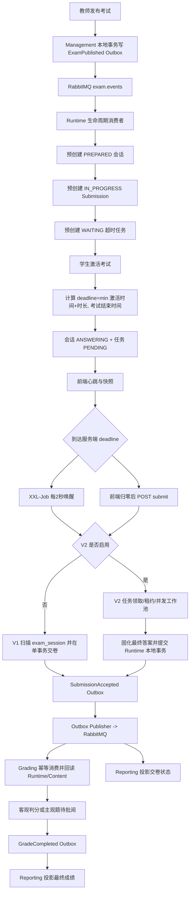

# 超时交卷完整流程、缺陷分析与优化建议

> 初次分析日期：2026-08-19；P0 修复日期：2026-08-20
>
> 分析范围：当前微服务实现，重点覆盖 Gateway、Frontend、Management、Runtime、XXL-Job、MySQL/Redis、Outbox/RabbitMQ、Grading、Reporting。
>
> 结论边界：本文依据仓库当前代码、Nacos 源配置、Compose、Flyway 迁移、运维文档和本次实际测试；未读取运行中 Nacos 的最终配置，也未验证生产/本地业务栈的实时状态。

## 1. 结论摘要

当前方案的目标架构方向基本正确：以 Runtime 的 MySQL 会话和超时任务作为权威状态，XXL-Job 只负责唤醒，V2 通过任务租约、`FOR UPDATE SKIP LOCKED`、最终答案固化和 Outbox 实现多实例处理及最终一致性。

但当前不能把 V2 描述为“已经具备可上线的高并发可靠性”，主要原因如下：

1. **仓库默认仍关闭 V2。** `docker-compose.yml` 已向 Runtime 显式透传 `APP_TIMEOUT_SUBMISSION_V2_ENABLED`，但默认值为 `false`；除非部署环境明确设置为 `true`，否则实际走 V1 旧链路。
2. **V2 的并发重复交卷死锁已修复。** 任务缺失补偿已移出交卷主事务，主事务按 Task、Session、Submission 顺序加锁，并对完整事务增加有限死锁重试；100 并发集成测试已通过。
3. **前端过早清理草稿问题已修复。** `SUBMITTING` 现在只表示服务器接管，只有 `runtimeFinalized=true` 或兼容的 Runtime 最终状态才能清理 IndexedDB 草稿和离页。
4. **截止瞬间仍存在快照竞态。** 超时任务先把会话改成 `AUTO_SUBMITTING`，再从 Redis/MySQL读取最新草稿；Redis 租约续约脚本不校验 MySQL 会话状态，因此“截止前已到达但仍在途”的快照可能在最终草稿读取之后写入，随后又被清理，未进入最终答案。
5. **任务租约在排队时就开始计时，且没有续租。** 默认一次领取 200 条、工作线程 8 个、租约 60 秒；队尾任务可能尚未开始处理就已消耗大部分租约。`max-run-ms` 也不能中断卡住的任务。
6. **永久失败缺少业务闭环。** V2 任务到达最大尝试次数后变为 `FAILED`，但会话仍停在 `AUTO_SUBMITTING`；当前主要依赖运维 SQL 手工重放，没有自动补偿、受审计的管理接口或学生端可靠提示闭环。

综合判断：**本文 P0～P2 的代码内修复和目标模块验证已完成，但 V2 仍应保持关闭。** 当前剩余上线阻断项是隔离环境两/四实例万人压测、RabbitMQ/XXL-Job 等完整故障注入、告警接收验证与全实例一致性核对；V1 可以作为兼容路径继续运行，但不能作为长期目标方案。

## 2. 系统边界与权威数据

### 2.1 模块职责

| 模块 | 超时交卷职责 |
| --- | --- |
| 前端 `ExamDoing.vue` | 展示服务端截止时间、定时保存草稿、倒计时归零后发起最小接管请求、轮询状态、处理离线恢复 |
| Gateway | 将 `/api/v1/exams/*/submit`、`snapshot` 和状态查询路由到 Runtime；答题写接口限制请求体为 5 MB |
| Management | 发布考试并通过 Outbox 产生 `ExamPublished`/`ExamTerminated` |
| Runtime | 持有会话、草稿、Submission、超时任务和最终答案；完成手工交卷/超时交卷互斥；写入 `SubmissionAccepted` Outbox |
| XXL-Job | 每 2 秒广播唤醒 `examTimeoutSubmitJob`，不持有交卷业务状态 |
| Redis | 客户端租约与最新答题快照快路径；不是最终交卷状态的唯一权威源 |
| Runtime MySQL | `exam_session`、`submission`、`submission_timeout_task`、`submission_final_payload`、`outbox_event` 的权威存储 |
| RabbitMQ | 至少一次投递 `SubmissionAccepted` 等领域事件 |
| Grading | 幂等消费交卷事件，通过 Feign 回读 Runtime 最终答案和 Content 试卷快照，完成客观题判分/创建主观题任务 |
| Reporting | 消费 `SubmissionAccepted`、`GradeCompleted` 等事件，形成学生成绩和监控投影 |

### 2.2 一致性边界

V2 的本地完成边界是以下数据在 **Runtime 单库同一事务** 内成功提交：

- `submission_final_payload` 最终答案；
- `submission.status = PROCESSING`、`submitted_at`、`timeout_submit = 1`；
- `exam_session.status = SUBMITTED`；
- `submission_timeout_task.status = DONE`；
- `SubmissionAccepted` Outbox 事件。

事务提交后才清理 Redis 快照。RabbitMQ Confirm、Grading 判分、主观题批阅、`GradeCompleted` 和 Reporting 投影均位于事务边界之外，语义是“至少一次投递 + 消费端幂等 + 最终一致”，不是 exactly-once，也不属于超时交卷本地完成 SLA。

## 3. 当前配置到底走 V1 还是 V2

### 3.1 仓库默认结论

- [`deploy/nacos-config/exam-runtime-service.yml`](../deploy/nacos-config/exam-runtime-service.yml) 将 `enabled` 配置为 `${APP_TIMEOUT_SUBMISSION_V2_ENABLED:false}`。
- [`docker-compose.yml`](../docker-compose.yml) 已显式注入 `APP_TIMEOUT_SUBMISSION_V2_ENABLED`，默认值为 `false`。
- 因此，按仓库标准 Compose 和源 Nacos 配置启动时，**超时交卷默认走 V1**。
- [`deploy/TIMEOUT_SUBMISSION_OPERATIONS.md`](../deploy/TIMEOUT_SUBMISSION_OPERATIONS.md) 明确要求上线时先保持 V2 关闭，完成迁移和核对后再统一开启，这说明该开关本身也是发布闸门。

### 3.2 不能从仓库直接确认的内容

运行中的 Nacos 可能已经把该值改成字面量 `true`，外部编排也可能额外注入环境变量。本次没有读取运行中 Nacos、XXL-Job 控制台和 Runtime 容器的最终配置，因此本文使用以下表述：

- **仓库默认/标准 Compose：V1；**
- **V2：代码已存在，但是否在某个环境启用需要现场确认。**

## 4. 完整业务流程



### 4.1 发布阶段：预创建会话、Submission 和任务

1. Management 发布考试并写入 `ExamPublished` Outbox。
2. Runtime 的 `RuntimeExamLifecycleConsumer` 消费事件，调用 `ExamProvisioningService.provision`。
3. Runtime 按候选学生批量预创建：
   - `exam_session.status = PREPARED`，尚无个人截止时间；
   - `submission.status = IN_PROGRESS`；
   - `submission_timeout_task.status = WAITING`，`due_at = NULL`。
4. 数量核对要求 Session、Submission、Timeout Task 都等于冻结考生数；成功后 Runtime 考试投影变为 `READY`。

主要实现：

- [`RuntimeExamLifecycleConsumer.java`](../services/exam-runtime-service/src/main/java/com/ekusys/exam/runtime/messaging/RuntimeExamLifecycleConsumer.java)
- [`ExamProvisioningService.java`](../services/exam-runtime-service/src/main/java/com/ekusys/exam/runtime/entry/ExamProvisioningService.java)
- [`V9__exam_entry_v2.sql`](../services/exam-runtime-service/src/main/resources/db/migration/V9__exam_entry_v2.sql)

### 4.2 激活阶段：确定个人截止时间

学生通过 V2 入场激活后，Runtime 使用数据库时间计算：

```text
deadline = min(activatedAt + durationMinutes, examEndTime)
```

同一激活事务内：

- `exam_session: PREPARED -> ANSWERING`；
- 写入 `start_time`、`deadline_time` 和客户端租约；
- `submission_timeout_task: WAITING -> PENDING`；
- 将 `due_at` 更新为该学生个人截止时间；
- 写入 `SessionStarted` Outbox。

旧入场路径也会在创建/恢复会话后调用 `timeoutTasks.ensureTask(...)`，保证任务存在。

主要实现：

- [`ExamActivationTransactionService.java`](../services/exam-runtime-service/src/main/java/com/ekusys/exam/runtime/entry/ExamActivationTransactionService.java)
- [`ExamRuntimeService.java`](../services/exam-runtime-service/src/main/java/com/ekusys/exam/runtime/service/ExamRuntimeService.java)

### 4.3 作答阶段：租约、快照和最终答案来源

1. 前端每秒根据 `deadlineTime` 更新倒计时，定时将完整答案保存到 IndexedDB，并同步到 `/snapshot`。
2. `/snapshot` 先校验答案和版本，再续客户端租约。
3. 正常情况下，最新完整草稿写入 Redis；Redis 不可用时同步落到 Runtime MySQL。
4. Redis 草稿异步增量刷入 MySQL，使用 `snapshotVersion` 防止旧版本覆盖新版本。
5. 超时交卷读取 `ExamSnapshotService.loadLatestDraft`：先读 MySQL 草稿版本，再读 Redis；Redis 版本更高时选 Redis，否则选 MySQL。

这里的“最终答案”是截止时服务端已经接受的最新完整草稿，不是浏览器本地尚未同步的草稿。

主要实现：

- [`ExamSnapshotService.java`](../services/exam-runtime-service/src/main/java/com/ekusys/exam/runtime/service/ExamSnapshotService.java)
- [`SnapshotPersistenceService.java`](../services/exam-runtime-service/src/main/java/com/ekusys/exam/runtime/service/SnapshotPersistenceService.java)
- [`ExamClientLeaseService.java`](../services/exam-runtime-service/src/main/java/com/ekusys/exam/runtime/service/ExamClientLeaseService.java)

### 4.4 截止触发有三个入口

#### 入口 A：服务端 XXL-Job

- 新数据卷初始化脚本创建 `examTimeoutSubmitJob`；
- CRON 为 `0/2 * * * * ?`，即每 2 秒；
- 路由策略为 `SHARDING_BROADCAST`；
- 阻塞策略为 `SERIAL_EXECUTION`；
- 失败重试由业务任务表承担，XXL-Job 自身失败重试次数为 0。

主要实现：

- [`02-configure-xxl-job.sh`](../deploy/mysql/init/02-configure-xxl-job.sh)
- [`ExamTimeoutSubmitJob.java`](../services/exam-runtime-service/src/main/java/com/ekusys/exam/runtime/job/ExamTimeoutSubmitJob.java)

#### 入口 B：浏览器倒计时归零

前端停止倒计时并调用 `submit(false)`：

- 在线：发送 `answers: []` 的最小接管请求，不再主动同步答案；
- 如果浏览器先归零但服务端尚未截止，服务端会因空答案返回 `INVALID_EXAM_ANSWERS`，前端再携带完整答案执行正常手工交卷；
- 离线：保留本地草稿和待交卷意图，恢复网络后由服务端状态决定结果。

主要实现：

- [`submissionFlow.js`](../src/main/resources/frontend/src/utils/submissionFlow.js)
- [`ExamDoing.vue`](../src/main/resources/frontend/src/views/student/ExamDoing.vue)

#### 入口 C：手工交卷请求到达时服务端已截止

Runtime 使用数据库时间判断截止。即使请求答案为空或格式不满足正常交卷校验，也不直接拒绝，而是转交超时任务，避免客户端时钟差导致交卷入口失效。

### 4.5 V1 默认路径

当 V2 关闭时：

1. XXL-Job 按 `MOD(session.id, shardTotal)` 查询已截止 `ANSWERING` 会话，或 `claim_time` 超过 60 秒的 `AUTO_SUBMITTING` 会话；每分片每轮最多 200 条。
2. 单条事务中把会话抢占为 `AUTO_SUBMITTING`。
3. 读取最新 Redis/MySQL 草稿。
4. 将现有 Submission upsert 为 `PROCESSING`，`timeout_submit = 1`。
5. 删除并重建 `submission_answer` 最终答案。
6. 写入 `SubmissionAccepted` Outbox。
7. 会话改为 `SUBMITTED`，事务提交后清理 Redis 草稿。
8. 单条失败只记录日志；后续依赖下一次扫描再次恢复，没有 V2 任务级错误、退避和永久失败状态。

主要实现：

- [`TimeoutSubmissionService.java`](../services/exam-runtime-service/src/main/java/com/ekusys/exam/runtime/service/TimeoutSubmissionService.java)
- [`TimeoutSessionMapper.java`](../services/exam-runtime-service/src/main/java/com/ekusys/exam/runtime/repository/TimeoutSessionMapper.java)

### 4.6 V2 目标路径

当 V2 开启时：

1. 每次执行先补齐缺失的 PENDING 任务。
2. 在 READ COMMITTED 事务中优先领取租约已过期的 `PROCESSING` 任务，再领取已经到期且允许重试的 `PENDING` 任务。
3. 使用 UUID `claim_token` 和 `lease_until` 标识任务所有权，增加 `attempt_count`。
4. 同一领取事务把会话从 `ANSWERING` 改为 `AUTO_SUBMITTING`，实现与手工交卷的互斥。
5. 任务在线程池中读取最新草稿并编码为 `GZIP_JSON_V1`，同时计算 SHA-256。
6. 最终事务再次校验任务令牌和租约未过期，然后：
   - 写 `submission_final_payload(source=TIMEOUT)`；
   - `submission: IN_PROGRESS -> PROCESSING`；
   - 写 `SubmissionAccepted` Outbox；
   - `exam_session: AUTO_SUBMITTING -> SUBMITTED`；
   - `submission_timeout_task: PROCESSING -> DONE`；
   - 事务提交后清理 Redis 草稿。
7. 失败时按指数退避加抖动重试；默认 12 次后进入 `FAILED`。

主要实现：

- [`TimeoutSubmissionCoordinator.java`](../services/exam-runtime-service/src/main/java/com/ekusys/exam/runtime/service/TimeoutSubmissionCoordinator.java)
- [`TimeoutTaskRepository.java`](../services/exam-runtime-service/src/main/java/com/ekusys/exam/runtime/repository/TimeoutTaskRepository.java)
- [`SubmissionFinalPayloadService.java`](../services/exam-runtime-service/src/main/java/com/ekusys/exam/runtime/service/SubmissionFinalPayloadService.java)
- [`V8__timeout_submission_v2.sql`](../services/exam-runtime-service/src/main/resources/db/migration/V8__timeout_submission_v2.sql)
- [`V10__optimize_timeout_submission_claim.sql`](../services/exam-runtime-service/src/main/resources/db/migration/V10__optimize_timeout_submission_claim.sql)

### 4.7 手工交卷与超时交卷互斥

V2 手工交卷也复用同一套 Session/Task 状态：

- 先锁 `submission_timeout_task`，再锁 `exam_session`；
- 只有 Task 仍为 `PENDING`、Session 为 `ANSWERING`、服务端未截止且客户端租约匹配时，才能把 Session 改为 `AUTO_SUBMITTING`；
- 如果任务已经是 `PROCESSING` 或 Session 已是 `AUTO_SUBMITTING`，手工入口只返回 `SUBMITTING`；
- 成功后写 `submission_final_payload(source=MANUAL)`，再完成 Submission、Session、Task 和 Outbox。

该设计意图是让“手工交卷”和“超时交卷”最多只有一个最终提交者，但当前并发集成测试已经证实锁实现仍有问题，见 T-01。

### 4.8 事件、判分与报表

1. Runtime Outbox Publisher 每秒扫描并向 `exam.events` 发布 `SubmissionAccepted`，RabbitMQ Confirm 成功后标记 `PUBLISHED`。
2. Grading 使用 `inbox_event(event_id, consumer_name)` 去重。
3. Grading 通过内部 Feign 接口 `/internal/v1/submissions/{id}/grading-input` 回读 Runtime 最终答案；V2 优先读 `submission_final_payload`，否则兼容读 `submission_answer`。
4. Grading 再从 Content 读取试卷快照：客观题立即判分，主观题创建待批阅任务。
5. 全部判分完成后，Grading 通过自己的 Outbox 发布 `GradeCompleted`。
6. Reporting 消费 `SubmissionAccepted` 投影“已交卷/处理中”，消费 `GradeCompleted` 投影最终成绩。

主要实现：

- [`RuntimeOutboxService.java`](../services/exam-runtime-service/src/main/java/com/ekusys/exam/runtime/messaging/RuntimeOutboxService.java)
- [`OutboxPublisher.java`](../platform/exam-outbox-support/src/main/java/com/ekusys/exam/common/outbox/OutboxPublisher.java)
- [`SubmissionAcceptedConsumer.java`](../services/exam-grading-service/src/main/java/com/ekusys/exam/grading/messaging/SubmissionAcceptedConsumer.java)
- [`GradingService.java`](../services/exam-grading-service/src/main/java/com/ekusys/exam/grading/service/GradingService.java)
- [`ReportingEventConsumer.java`](../services/exam-reporting-service/src/main/java/com/ekusys/exam/reporting/messaging/ReportingEventConsumer.java)

## 5. 状态机

### 5.1 Session

| 当前状态 | 触发 | 下一状态 | 说明 |
| --- | --- | --- | --- |
| `PREPARED` | 学生激活 | `ANSWERING` | 写个人截止时间和客户端租约 |
| `ANSWERING` | 手工交卷抢占成功 | `AUTO_SUBMITTING` | 交卷事务中的互斥中间态 |
| `ANSWERING` | 超时任务抢占成功 | `AUTO_SUBMITTING` | 服务端截止后自动接管 |
| `AUTO_SUBMITTING` | Runtime 本地最终事务成功 | `SUBMITTED` | 清理客户端租约 |
| `AUTO_SUBMITTING` | 尝试耗尽且无最终结果 | `SUBMISSION_FAILED` | 记录稳定失败码和事件号 |
| `SUBMISSION_FAILED` | 审计重放通过 | `AUTO_SUBMITTING` | 仅恢复原任务，不直接生成结果 |
| `PREPARED` | 考试终止 | `CANCELLED` | 取消尚未激活的会话 |
| `ANSWERING` | 考试终止 | `ANSWERING` | 截止和任务到期时间加速到数据库当前时间，由正常超时链抢占 |

### 5.2 Timeout Task

| 当前状态 | 触发 | 下一状态 | 说明 |
| --- | --- | --- | --- |
| `WAITING` | 会话激活 | `PENDING` | 写入 `due_at` |
| `PENDING` | 到期且被领取 | `PROCESSING` | 写 claim token、lease、attempt |
| `PROCESSING` | 本地最终事务成功 | `DONE` | 交卷完成 |
| `PROCESSING` | 可重试异常 | `PENDING` | 写 `next_retry_at` 和 `last_error` |
| `PROCESSING` | 尝试耗尽/无效状态 | `FAILED` | 当前需要运维介入 |
| `FAILED` | 审计重放校验通过 | `PENDING` | `replay_count + 1`，不生成答案或 Outbox |
| `PROCESSING` | 租约过期 | `PROCESSING` | 被新 token 重新领取，旧 token 不能完成 |
| `WAITING` | 考试终止 | `CANCELLED` | 仅尚未激活任务 |

### 5.3 Submission

| 当前状态 | 触发 | 下一状态 | 说明 |
| --- | --- | --- | --- |
| `IN_PROGRESS` | 手工或超时最终事务成功 | `PROCESSING` | 表示 Runtime 已接受，等待异步判分 |
| `IN_PROGRESS` | 未激活考试被终止 | `CANCELLED` | 不进入判分 |

Runtime 的 `submission.status` 不会被 Grading 回写为 `GRADED`；最终成绩状态属于 Grading/Reporting 各自 Schema。因此前端不能把 Runtime 的 `PROCESSING` 理解为“判分已完成”。

## 6. 缺陷与不足

### T-00：V2 默认未启用，开启时必须保证全部 Runtime 配置一致（P0 上线闸门已补齐）

**证据**

- Nacos 源配置默认 `false`；
- Runtime Compose 环境已声明 `APP_TIMEOUT_SUBMISSION_V2_ENABLED`，但默认关闭；
- V2 运维文档要求修改环境文件后重建全部 Runtime 容器。

**影响**

- 当前仓库标准启动仍使用 V1，V2 的任务租约、持久化失败状态、退避、最终载荷哈希和指标不会生效；
- 仅修改宿主机 `.env.microservices` 而不重建 Runtime 容器不会更新容器环境；
- 多实例若开关不一致，会出现 V1 固定分片和 V2 数据库任务领取混跑，状态语义难以保证。

**建议**

1. 先修复 T-01、T-02、T-03，再考虑开启；
2. `docker-compose.yml` 已显式透传 `APP_TIMEOUT_SUBMISSION_V2_ENABLED`，并保持默认 `false`；
3. Runtime 启动日志和 XXL-Job 执行日志已输出非敏感的最终模式与关键容量参数；上线时逐实例核对；
4. 发布时暂停 XXL-Job，统一升级全部实例、核对缺失任务为 0 后再统一开关，禁止长期混跑。

### T-01：V2 并发重复手工交卷出现真实 MySQL 死锁（P0，已修复并验证）

**本次实测**

`TimeoutSubmissionV2MySqlTest.oneHundredConcurrentManualRetriesCreateOnePayloadAndOneLogicalEvent` 报错：

```text
CannotAcquireLockException
Deadlock found when trying to get lock
at TimeoutTaskRepository.lockBySession(... FOR UPDATE)
```

**代码链**

`ManualSubmissionService.submit` 在每个重复请求的事务内先执行 `ensureTask` 的 `INSERT IGNORE`，再对同一个任务执行 `SELECT ... FOR UPDATE`。在任务已经存在时，大量并发重复键插入与后续排他锁升级会显著增加死锁概率。本次没有抓取 `SHOW ENGINE INNODB STATUS` 的完整等待图，因此“具体哪两个锁形成环”仍需补证，但“当前实现会在目标并发场景发生死锁”已经由测试直接证实。

**影响**

- 浏览器重试、网关重试或用户重复点击可能返回 5xx；
- 前端可能转入状态不确定轮询；
- 如果没有事务级死锁重试，即使最终只有一个请求需要真正提交，其余幂等请求也会失败。

**建议**

1. 从手工交卷热事务移除无条件 `INSERT IGNORE`；任务应由发布预创建、激活事务或独立 reconciliation 保证；
2. 统一所有路径锁顺序，例如 `timeout_task -> exam_session -> submission`，不要在拿到记录锁前做重复键写入；
3. 任务缺失时走单独、可重入的补偿流程，补齐后重新进入主事务；
4. 在锁顺序修复后，对 `DeadlockLoserDataAccessException`/`CannotAcquireLockException` 增加小次数、带抖动的整个事务重试；不能只重试最后一条 SQL；
5. 保留并增强 100 并发测试，至少连续运行 50～100 轮，要求无异常且最终载荷、Outbox、Session、Task 都只有一个逻辑结果。

**修复结果（2026-08-20）**

- `ensureTask` 已移出交卷主事务；正常请求先检查任务，缺失时从 `exam_session` 在独立短语句中补偿；
- 主事务保持 `timeout_task -> exam_session -> submission/final_payload -> outbox` 顺序；
- `CannotAcquireLockException` 对整个事务最多重试 3 次，带短随机退避；
- 100 个并发重复交卷集成测试通过，最终载荷、逻辑 Outbox、Session 和 Task 断言全部通过。

### T-02：`SKIP LOCKED` 双领取者测试失败（P0，测试根因已纠正并完成索引优化）

**本次实测**

`TimeoutSubmissionV2MySqlTest.twoClaimersUseSkipLockedAndStaleTokenCannotComplete` 预期两个领取者各领取 10 条，实际一方得到 0 条：

```text
Expected size: 10 but was: 0
```

**复核后的真实原因**

原测试使用 JVM `LocalDateTime.now()` 生成 `due_at`，而 MySQL Testcontainer 的数据库当前时间与 JVM 本地时区相差 8 小时。插入任务对数据库而言尚未到期，两个领取者实际都领取到 0 条；因此原失败不能证明 `SKIP LOCKED` 本身失效。

同时，原查询按 `due_at,id` 排序，但索引中间包含 `next_retry_at`，执行计划仍存在扩大扫描风险。修复新增生成列 `available_at=max(due_at,next_retry_at)` 和 `(status,available_at,id)` 专用索引，领取查询显式使用该索引。

**影响**

- 多 Runtime 实例不能按预期线性扩展；
- 同刻 10,000 人交卷时可能由单个实例/单次领取承担大部分工作；
- P99 和最大完成延迟风险上升。

**建议**

1. 新增 Flyway 迁移，建立与查询排序一致的领取索引，例如先验证 `(status, due_at, id)`；禁止修改 V8 已发布迁移；
2. 更彻底的方案是将 `due_at` 与 `next_retry_at` 归一为单一 `available_at`，使用 `(status, available_at, id)` 领取；
3. 使用 `EXPLAIN ANALYZE` 验证无 filesort、扫描行数接近 limit；
4. 在两个真实数据库连接、READ COMMITTED 下循环验证无重叠、总数完整、分配接近预期；
5. 再执行两实例 10,000 会话压测，以数据库 `due_at -> completed_at` 计算 P99，不能只看 k6 客户端结果。

**修复结果（2026-08-20）**

- 集成测试的 deadline、dueAt 全部改为数据库 `current_timestamp(3)` 派生；
- 新增 `V10__optimize_timeout_submission_claim.sql`，没有修改已发布 V8；
- 两个真实连接在 READ COMMITTED 下各领取 10 条，无重叠、无遗漏；旧 token 和过期租约断言通过；
- 尚未执行 10,000 会话容量验证，因此不能声称已达到目标 SLA。

### T-03：前端在 `SUBMITTING` 时过早清理本地草稿并离页（P0，已修复）

**证据链**

1. V2 截止后的 API 只调用 `acceptExpired`，返回 `SUBMITTING` 时后台任务可能仍是 `PENDING` 或 `PROCESSING`；
2. `isSubmissionAccepted` 把 `SUBMITTING`、`AUTO_SUBMITTING` 都判定为成功接管；
3. `submit()` 因此不继续轮询，直接调用 `completeSubmissionUi`；
4. `completeSubmissionUi` 会清除 IndexedDB 草稿、同步队列、客户端租约并跳到成绩页；
5. 后台任务之后仍可能多次重试并最终 `FAILED`。

**影响**

- 学生看到“已经交卷”，实际 Runtime 还未完成本地最终事务；
- 后台永久失败时本地答案取证副本已经删除；
- 进入成绩页后可能暂时无成绩，且原页面无法显示任务失败状态。

**建议**

1. 明确两级状态：
   - `ACCEPTED/SUBMITTING`：服务器已接管，但不可清草稿；
   - `FINALIZED`：`session=SUBMITTED`、`task=DONE`、`submission=PROCESSING`，此时才允许清草稿和离页；
2. `SUBMITTING` 时保持遮罩并轮询，45 秒后仍未完成则保留草稿，进入“后台处理中”页面，而不是伪装完成；
3. `FAILED` 时停止自动清理，展示可重试/联系客服的稳定错误码；
4. 本地草稿可在最终完成后延迟清理一段时间，只保留加密/受限的恢复副本，不长期保留明文答案；
5. 增加组件级测试：`SUBMITTING -> FAILED`、`SUBMITTING -> DONE`、网络超时后状态查询、刷新页面恢复。

**修复结果（2026-08-20）**

- Runtime 提交响应和状态查询新增 `phase`、`runtimeFinalized` 兼容字段；
- 前端拆分“服务器接管”和“Runtime 最终完成”，轮询只在最终完成时返回成功；
- `completeSubmissionUi` 增加最终状态防御校验，`SUBMITTING`、`AUTO_SUBMITTING` 和 `FAILED` 均不会清除草稿；
- 前端流程测试 7 个全部通过，生产构建成功。

### T-04：截止瞬间存在“快照已接受但未进入最终答案”的竞态（P1，已修复）

**代码链**

1. 超时领取事务把 Session 改为 `AUTO_SUBMITTING`；
2. 工作线程在事务外调用 `loadLatestDraft`；
3. Redis 续租 Lua 只检查 Redis 中的 token 和 deadline，不检查 MySQL Session 是否仍为 `ANSWERING`；
4. 一个截止前已经通过续租、但仍在途的快照可能在步骤 2 之后写入 Redis；
5. 最终事务固化之前读取到的旧版本，并在提交后清理 Redis，新快照被丢弃。

**影响**

- 最后一题或最后几秒的答案可能未进入最终载荷；
- 仅靠快照版本无法解决，因为最终固化没有“停止新快照 + 读取最终版本”的原子栅栏。

**建议**

1. 建立数据库权威的 finalization fence：快照接收和超时抢占必须对同一 Session 进行有序互斥；
2. 临近截止时间的快照直接同步落 MySQL，并在同一事务校验 `ANSWERING`、服务端接收时间和版本；
3. 超时事务拿到 Session 锁后阻止新快照，再读取已提交的最高版本并固化；
4. 明确定义“有效答案”的规则：以服务端接收时间不晚于 deadline 为准，而不是客户端时间；
5. 增加确定性并发测试：在 `loadLatestDraft` 前后插入闩锁，验证截止前已接收快照必定进入最终载荷，截止后快照必定拒绝。

### T-05：时间源不统一，前端也未使用服务端时钟偏移（P1，已修复）

**证据**

- 开始考试、激活、手工提交截止判断、任务领取使用数据库 `current_timestamp(3)`；
- heartbeat 和 snapshot 的 `receivedAt` 使用 JVM `LocalDateTime.now()`；
- Redis Lua 使用由 JVM 传入的 epoch；
- V2 激活响应已经返回 `serverTime`，但 `ExamDoing.vue` 倒计时仍直接用本机 `Date.now()`；
- 后端返回的是无时区 `LocalDateTime`，前端按浏览器本地时区解析。

**影响**

- JVM、MySQL、浏览器任一时钟偏差都可能导致提前归零、延迟归零或截止边界不一致；
- 当前“空答案先试、收到 `INVALID_EXAM_ANSWERS` 再带完整答案重试”只是兼容补丁，不是时钟同步机制。

**建议**

1. 服务端业务截止统一使用数据库时间或统一注入的权威 `Clock`，不要在同一链路混用 JVM/DB 时间；
2. API 使用 `Instant`/带 offset 的时间格式；
3. 前端在 prepare/activate/start 时计算 `serverTime - clientReceiveTime` 偏移，倒计时使用校正后的服务器时间；
4. 将 RTT/2 作为误差估计，偏差过大时提示校准设备时间，但最终决定仍由服务端做出；
5. 测试 JVM 与 MySQL ±30 秒、浏览器 ±5 分钟的场景。

### T-06：任务在工作池排队期间租约已开始消耗，且无续租（P1，已修复）

**修复前默认参数**

- batch size：200；
- worker count：8；
- lease：60 秒；
- executor queue：200。

修复前领取事务会一次性给整批任务写入 60 秒租约，再把全部任务提交到 8 线程工作池。队尾任务需要等待前面多轮任务完成；如果平均单任务处理超过约 2.4 秒，队尾在开始前就可能接近或超过租约，当时也没有 lease heartbeat/renew。

**影响**

- 任务尚未执行就变成过期租约；
- 另一个实例重新领取，旧工作线程最后只能得到 `stale_claim`；
- `attempt_count` 被无效消耗，极端情况下达到 12 次后误判永久失败。

**建议**

1. 每次只领取当前可立即执行的容量，建议 `claimLimit <= 可用线程数 + 极小预取`；
2. 或在线程真正开始执行时再建立租约；
3. 长任务增加带 token 条件的租约续租；
4. 校验配置关系：`leaseMs > 单任务硬超时 + 数据库事务上限 + 安全余量`；
5. 增加“200 条任务、8 线程、每条延迟 3 秒”的测试，要求不会因排队耗尽尝试次数。

### T-07：`max-run-ms` 不是严格运行上限（P1，已修复）

修复前 `processDue` 只在领取下一批前检查 `System.nanoTime()`，随后对整批 `CompletableFuture.allOf(...).join()` 无期限等待。任一 Redis/数据库调用长期阻塞时：

- 本轮可远超 25 秒；
- XXL-Job 的 `executor_timeout=0` 不会中断；
- `SERIAL_EXECUTION` 会让后续触发不能在同一执行器上正常推进。

本次全量 Runtime 测试也出现了类似的无界网络等待：Redis 重启测试在 `connection.ping()` 卡住超过 3 分钟后只能人工中断。这不是超时任务本身的断言失败，但说明依赖调用必须有硬超时。

**建议**

1. 为 Redis、JDBC 获取连接、SQL 和工作 Future 设置明确超时；
2. `allOf` 使用剩余运行预算进行有界等待；
3. 到达预算后不再领取，并让未开始任务安全释放/缩短租约；
4. XXL-Job 设置大于单轮预算但有限的 executor timeout；
5. 指标增加 `last_success_at`、job duration、timeout/cancelled 数量。

### T-08：`FAILED` 后 Session 永久停留在 `AUTO_SUBMITTING`（P1，已修复）

修复前失败处理只把 Task 改为 `FAILED`，不会改变 Session，安全重放依赖运维人员暂停 XXL-Job 后执行 SQL。

**影响**

- 学生无法继续答题、无法再次手工交卷；
- 重新入场只会得到 `SUBMITTING`；
- 如果前端已按 T-03 清草稿，恢复难度更高。

**建议**

1. 增加显式业务状态 `SUBMISSION_FAILED` 或等价失败原因，不要让 `AUTO_SUBMITTING` 同时表达“处理中”和“永久失败”；
2. 增加受 `SCOPE_internal`/管理员权限保护、带操作审计的单任务重放接口，内部仍使用任务 token/状态条件，避免随意 SQL；
3. 增加自动 reconciliation：发现 `FAILED + session=AUTO_SUBMITTING + submission=IN_PROGRESS` 时告警并进入人工队列；
4. 重放前校验无最终载荷、无已发布 SubmissionAccepted，防止人为制造第二份结果；
5. 学生端保留本地草稿并显示稳定事件编号，便于客服定位。

### T-09：提前终止考试只取消 PREPARED，会放过正在作答的会话（P1，已修复）

修复前 `ExamProvisioningService.terminate` 只处理：

- `exam_session.status = PREPARED`；
- `submission_timeout_task.status = WAITING`；
- `submission.status = IN_PROGRESS` 且对应 PREPARED 会话。

已经 `ANSWERING` 的会话仍保留原 deadline，心跳与快照链也不会查询 Runtime 考试投影是否已 `TERMINATED`。

**影响**

如果“终止考试”的产品语义是立即停止当前考试，那么已进入的学生仍可继续答题，直到原截止时间才超时交卷。

**建议**

1. 先由产品确认语义：取消未开始考试，还是立即结束全部进行中考试；
2. 若要求立即结束，在同一 Runtime 本地事务批量将 ANSWERING 任务的 `due_at` 加速到数据库当前时间，并由正常超时交卷链收口；
3. 不要另写第二套强制交卷状态机；
4. 增加终止事件与超时任务并发、重复终止和部分失败测试。

### T-10：离线截止后的答案语义与界面文案不够明确（P2，已修复）

前端离线时会提示“本地答案已保留”，恢复网络后先尝试冲刷离线快照，再触发截止接管。但服务端若已经截止或 Session 已被自动抢占，离线快照会被拒绝，超时交卷使用的是截止前服务端已接受的最新草稿。

这在公平性上可以是合理策略，但“本地保留”容易让学生误以为离线期间的答案最终一定计入。

**建议**

1. 明确产品规则：截止后绝不接收本地答案，还是允许携带服务端签发的离线窗口证明补交；
2. 如果维持当前规则，文案改为“本地答案仅用于恢复/申诉，不保证计入，最终以截止前服务器已接收版本为准”；
3. 在成绩或申诉后台记录最终 `snapshot_version`、最后服务端接收时间、超时交卷来源和载荷哈希，不记录不必要的答案明文日志；
4. 不要在截止后把被业务拒绝的离线队列项目静默删除，应保留最小失败元数据供前端解释。

### T-11：观测和容量验收只有方案，没有仓库内通过证据（P2）

仓库已经提供指标、运维 SQL 和 10,000 人 k6 脚本，这是优点；但没有保存一次合格压测的结果、环境规格、数据库 P99 查询结果和资源余量。

**影响**

- 不能声称 P99 < 30 秒、最大 < 60 秒已经达成；
- 当前 T-02 还表明多领取者并行假设失败，现有容量目标更不能直接成立。

**建议**

1. P0 修复后执行两实例和四实例两组 10,000 同刻截止压测；
2. 同时采集任务完成延迟、Hikari pending、MySQL CPU/IO/redo/锁等待、Redis 延迟和 Outbox 积压；
3. 做实例宕机、Redis 故障、MySQL 短暂故障、RabbitMQ 故障和 XXL-Job 停调故障注入；
4. 保存不含令牌/答案/密钥的验收报告；
5. 生产必须真正配置告警接收和 job-liveness 监控，不能只暴露 `/actuator/prometheus`。

### T-12：超时标记和状态语义没有完整投影（P2，已修复）

- 修复前 `SubmissionAccepted` 已包含 `timeoutSubmit`，但 Reporting 的 `projectSubmission` 没有保存该字段；
- Runtime `submission.status=PROCESSING` 表示“已接受等待判分”，Grading/Reporting 的 `PROCESSING/GRADED` 是另一套状态；
- 前端又把 `SUBMITTING`、`PROCESSING`、`SUBMITTED` 都归入 accepted，容易混淆。

**建议**

1. 在公共契约中定义清晰阶段：`HANDOFF_ACCEPTED`、`RUNTIME_FINALIZED`、`GRADING_PENDING`、`GRADED`；
2. Reporting 增量迁移保存 `timeout_submit`、最终提交来源和 finalized time；
3. 事件投影更新必须单调，迟到的 `SubmissionAccepted` 不能把已 `GRADED` 的投影降级为 `PROCESSING`；
4. 修改事件字段时检查 Runtime 生产者、Grading/Reporting 消费者和历史消息兼容性，并按公共契约规则串行发布。

### T-13：测试覆盖尚未覆盖关键截止闭环（P2，代码内覆盖已补齐）

已有测试覆盖了很多局部能力，但缺少或当前失败的关键场景包括：

- 前端组件从倒计时归零到真正 `DONE` 的完整状态机；
- `SUBMITTING -> FAILED` 不得清理草稿；
- 截止前在途快照与超时固化的确定性竞态；
- V2 100 并发重复交卷无死锁；
- 两实例 `SKIP LOCKED` 完整、无重叠且能均衡领取；
- 任务排队超过租约、长任务续租和 job 硬超时；
- 提前终止正在作答考试；
- Outbox、Grading、Reporting 全链路的故障恢复与状态单调。

**后续修复结果（2026-09-01）**

- V11 新增单行数据库草稿载荷、客户端序列、服务端修订号、压缩载荷和 SHA-256；快照事务与超时抢占共同锁定 Session，真实 MySQL 闩锁测试覆盖先提交必采纳、后到必拒绝、同序列幂等和旧基线不覆盖；
- heartbeat、snapshot、submit、prepare/activate/start 的边界判断统一使用数据库时间，租约/入场 Redis epoch 使用显式数据库时区；前端通过请求中点校时并使用 epoch 截止字段；
- V2 单次领取限制为工作线程数，默认 batch 8，新增单任务预算、续租、job 剩余预算和依赖超时；XXL-Job 外围超时设为 40 秒；
- 永久失败原子进入 `FAILED + SUBMISSION_FAILED`，学生状态返回 `failureCode/incidentId/retryable=false`；ADMIN 或考试发布教师通过带审计的接口重放，最终载荷或逻辑 Outbox 已存在时拒绝；
- 终止进行中考试会加速数据库截止和任务到期时间，仍由唯一超时状态机固化答案；离线截止后只认可服务器截止前接受的版本，本地未接受答案和失败元数据保留 7 天；
- `SubmissionAccepted` 升级为兼容 V2 事件，Reporting 新增投影列并验证 `GRADED` 不被迟到事件降级；前端显示最终快照版本和 Runtime 完成时间；
- Runtime、Reporting、Vue/Vitest/Node 流程测试和前端生产构建已经通过；Redis 重启测试改为有界命令并自然汇总。T-11 的两/四实例 10,000 人压测、完整故障注入和生产告警接收仍未执行，因此 V2 继续默认关闭。

## 7. 推荐修复方案

### 7.1 P0：先达到可开启 V2 的最低条件

1. 修复手工交卷死锁：移除热事务中的重复键 `INSERT IGNORE`，统一锁顺序，增加有界事务重试。
2. 新增 Flyway 索引迁移，修复 `SKIP LOCKED` 的执行计划和扩大锁定问题。
3. 重构前端交卷握手：`SUBMITTING` 只表示接管，`DONE/SUBMITTED` 才表示 Runtime 完成并允许清草稿。
4. 上述并发集成测试连续稳定通过；前端增加失败分支测试。
5. 在 `docker-compose.yml` 显式提供 V2 开关透传，但继续默认关闭。

### 7.2 P1：补齐截止一致性和失败恢复

1. 建立数据库 finalization fence，消除截止前在途快照丢失竞态。
2. 统一服务端时间源，并让前端使用服务器时钟偏移。
3. 按工作池可用容量领取任务；增加租约续租、单任务硬超时和严格单轮预算。
4. 引入 `SUBMISSION_FAILED`/等价状态、自动 reconciliation、审计化重放入口。
5. 明确并实现进行中考试被终止时的交卷策略。

### 7.3 P2：可观测性、契约和体验

1. Reporting 投影超时来源并保证状态单调。
2. 完善离线截止文案、恢复和申诉证据。
3. 接入真实 Prometheus/Alertmanager 或等价系统，监控 job liveness、P99、FAILED、最老逾期、租约恢复、Hikari pending 和 Outbox FAILED。
4. 完成 10,000 同刻截止容量及故障注入验收。

## 8. 建议的目标状态机与接口契约

### 8.1 API 返回建议

```json
{
  "submissionId": 123,
  "phase": "HANDOFF_ACCEPTED",
  "sessionStatus": "AUTO_SUBMITTING",
  "taskStatus": "PENDING",
  "runtimeFinalized": false,
  "retryable": true,
  "statusVersion": 7,
  "serverTime": "2026-08-19T21:00:00.123+08:00"
}
```

只有当 `runtimeFinalized=true` 时前端才能清草稿。`statusVersion` 用于防止轮询响应乱序导致界面状态回退。

### 8.2 推荐状态推进

```text
ANSWERING
  -> HANDOFF_ACCEPTED / AUTO_SUBMITTING
  -> RUNTIME_FINALIZED / SUBMITTED
  -> GRADING_PENDING
  -> GRADED

AUTO_SUBMITTING
  -> SUBMISSION_FAILED（永久失败，可审计重放）
  -> AUTO_SUBMITTING（重放）
  -> SUBMITTED
```

## 9. 验证计划

| 层级 | 必测场景 | 通过标准 |
| --- | --- | --- |
| Repository | 两连接并发领取 20 条 | 无重叠、无遗漏、两方均能领取；循环 100 次稳定 |
| Service | 100 次并发重复手工交卷 | 无异常；一个 final payload、一个逻辑 Outbox、Session SUBMITTED、Task DONE |
| Service | 手工交卷与超时任务同时抢占 | 只有一个完成者，另一方返回可查询中间态 |
| Snapshot | 截止前在途快照 | 必定计入最终版本；截止后必定拒绝 |
| Lease | 任务执行超过 lease/队列等待 | 租约可续或任务不被提前领取，旧 token 不能提交 |
| Failure | Redis/MySQL/Outbox 暂时失败 | 自动退避恢复，不提前清前端草稿 |
| Failure | 达到最大尝试次数 | 显式失败状态、告警、可审计重放，无伪成功 |
| Frontend | 在线、离线、时钟快/慢、刷新恢复 | 不重复交卷、不提前离页、不丢本地恢复信息 |
| Event | Outbox 重复、消费者重试、DLQ 重放 | 幂等且 Reporting 状态单调 |
| Capacity | 10,000 同刻截止 | 全部完成；DB 口径 P99 < 30 秒、max < 60 秒，资源有余量 |

## 10. 发布顺序建议

1. 修复代码和新增 Flyway 迁移，保持 V2 关闭。
2. 编译并测试 Runtime、API、Grading、Reporting 和前端；完成并发/故障/容量验收。
3. 备份 `exam_runtime`，统一升级全部 Runtime 实例，确认迁移成功。
4. 暂停 `examTimeoutSubmitJob`，等待当前执行结束。
5. 检查所有 `ANSWERING/AUTO_SUBMITTING` 会话均存在任务，检查无异常 `FAILED`。
6. 确认所有实例版本和开关来源一致，再统一开启 V2 并滚动重启。
7. 恢复 XXL-Job，观察积压、P99、租约恢复、数据库池和 Outbox。
8. 先小流量考试，再扩大；出现 P0/P1 指标异常时按运维文档暂停调度和安全回滚，禁止删除 Flyway 表或数据卷。

## 11. 本次实际验证结果

### 11.1 初次分析：后端定向测试

命令（使用本机已有 JDK 21，不修改默认 JDK 17）：

```bash
JAVA_HOME=/home/syusuke/.sdkman/candidates/java/21.0.12-tem \
PATH=/home/syusuke/.sdkman/candidates/java/21.0.12-tem/bin:$PATH \
bash ./mvnw -pl services/exam-runtime-service -am \
  -Dtest=TimeoutSubmissionServiceTest,TimeoutSubmissionCoordinatorTest,TimeoutSubmissionBackoffPolicyTest,TimeoutSubmissionV2MySqlTest,ManualSubmissionServiceTest,ExamRuntimeServiceSubmissionTest,ExamActivationTransactionMySqlTest,ExamProvisioningServiceMySqlTest \
  -Dsurefire.failIfNoSpecifiedTests=false test
```

结果：

- 共运行 23 个测试；
- 21 个通过；
- 1 个 failure、1 个 error，均来自 `TimeoutSubmissionV2MySqlTest`；
- failure：两个领取者预期各 10 条，实际一方 0 条；
- error：100 次并发重复手工交卷发生 MySQL deadlock；
- Maven 最终 `BUILD FAILURE`，因此不能声称 Runtime 测试通过。

### 11.2 初次分析：后端全量目标模块测试

执行：

```bash
JAVA_HOME=/home/syusuke/.sdkman/candidates/java/21.0.12-tem \
PATH=/home/syusuke/.sdkman/candidates/java/21.0.12-tem/bin:$PATH \
bash ./mvnw -pl services/exam-runtime-service -am test
```

结果：编译成功并运行了 Outbox、入场、生命周期、租约、快照、手工交卷等多组测试；执行到 `SnapshotFlushQueueRedisTest.persistedDirtyStateSurvivesRedisRestart` 后，在 Redis 重启后的 `connection.ping()` 阻塞超过 3 分钟，本次人工中断，退出码 130。该轮没有最终 Maven 汇总，不能作为全量通过证据。

首次直接执行 `./mvnw` 因文件无执行权限返回 `permission denied`；改用 `bash ./mvnw`。首次使用默认 JDK 17 时又因仓库要求 Java 21 而在编译前失败，之后改为命令级 JDK 21。

### 11.3 初次分析：前端验证

执行：

```bash
cd src/main/resources/frontend
npm run test:submission-flow
```

结果：6 个测试全部通过。但这些测试只覆盖 `submissionFlow.js` 的纯函数，没有覆盖 `ExamDoing.vue` 在 `SUBMITTING -> FAILED` 时的草稿清理问题。

随后执行 `npm run build`，因当前目录未安装前端依赖，报 `vite: command not found`，构建未完成。本文没有执行 `npm install`，也没有改动前端业务代码。

### 11.4 初次分析：未执行验证

- 未启动完整 Gateway/Management/Runtime/Grading/Reporting 业务栈做端到端交卷；
- 未读取运行中 Nacos、XXL-Job 控制台或数据库实时状态；
- 未执行 10,000 人同刻截止压测；
- 未执行生产告警验证、实例宕机和依赖故障注入；
- 初次分析阶段未修改任何业务代码、配置或已发布 Flyway 迁移。

### 11.5 P0 修复后的验证（2026-08-20）

- 后端定向命令运行 20 个测试，全部通过；覆盖 Runtime 响应契约、完整事务死锁重试、100 并发重复交卷、双连接并行领取、旧租约令牌以及 V1 至 V10 的 Flyway 迁移；
- 前端 `npm run test:submission-flow`：7 个测试全部通过；
- 前端 `npm run build`：构建成功，仅存在既有的大 chunk 警告；
- Runtime 全模块测试再次执行，已运行的 Outbox、Flyway、入场、租约、快照服务和交卷测试均无断言失败，但再次阻塞在 `SnapshotFlushQueueRedisTest` 的 Redis 重启场景，240 秒外层超时后退出，不能作为全量通过证据；
- 未执行完整微服务端到端和 10,000 人压测。

### 11.6 后续修复后的验证（2026-09-01）

- JDK 21 下 Runtime 目标模块及依赖共 107 个测试通过，0 failure、0 error、0 skipped；
- Reporting 目标模块及依赖共 6 个测试通过，真实 MySQL 已应用 V1～V6，验证事件兼容和投影单调；
- 前端 8 个 Vitest 组件/状态测试、7 个交卷纯函数测试、4 个入场纯函数测试全部通过，`npm run build` 成功；
- `git diff --check` 通过；
- 未执行隔离环境两/四实例 10,000 人同刻截止压测、完整微服务端到端、RabbitMQ/XXL-Job 故障注入和生产告警接收验证。

## 12. 最终优先级

| 优先级 | 项目 | 修复状态 | 是否阻断 V2 上线 |
| --- | --- | --- | --- |
| P0 | T-01 并发重复交卷死锁 | 已修复，定向测试通过 | 否 |
| P0 | T-02 领取测试时钟与索引 | 已修复，定向测试通过 | 否，但仍需容量验证 |
| P0 | T-03 SUBMITTING 误清草稿/误离页 | 已修复，前端测试和构建通过 | 否 |
| P0 | T-00 全实例统一开关与 Compose 透传 | 闸门已补齐，V2 仍默认关闭 | 启用时必须逐实例核对 |
| P1 | T-04 截止快照竞态 | 已修复，真实 MySQL 闩锁测试通过 | 否 |
| P1 | T-05 时间源不统一 | 已修复，JVM/浏览器时钟测试通过 | 否 |
| P1 | T-06/T-07 租约排队与无界运行 | 已修复，容量/预算/续租测试通过 | 否，但仍需万人容量验证 |
| P1 | T-08 永久失败业务闭环 | 已修复，失败与重放测试通过 | 否 |
| P1 | T-09 提前终止语义 | 已按立即强制收卷实现并验证 | 否 |
| P2 | T-10/T-12/T-13 体验、投影和代码内测试 | 已修复并通过目标模块验证 | 否 |
| P2 | T-11 容量、故障注入和生产告警 | 尚未执行环境验收 | 是，V2 继续默认关闭 |
